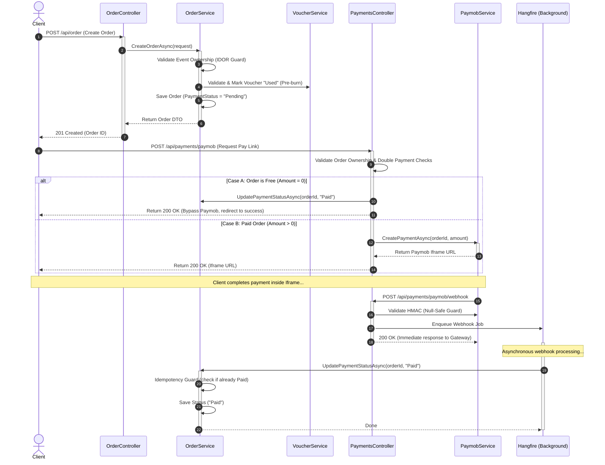
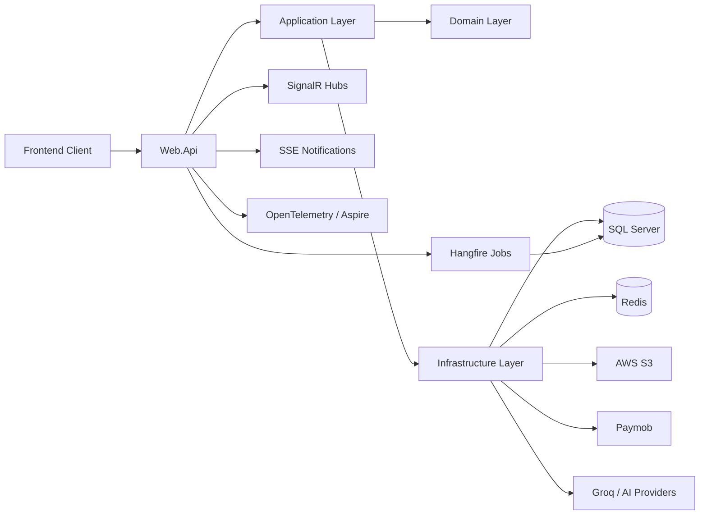
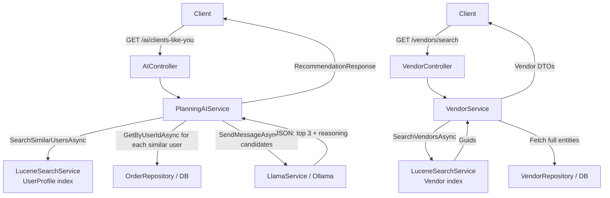

<!-- ========================================== -->
<!-- FILE: ai_endpoints_comparison.md -->
<!-- ========================================== -->

# AI Endpoints — What Each Tries to Do & Should You Remove One?

---

## What Each Endpoint Is Trying to Do

### `POST /api/event/createEventByAI/{eventId}`
> **"Plan my whole event for me."**

The user already created an event (budget, guest count, event type). They want the AI to **automatically select a set of services** from the catalog and compose a complete event package.

**Flow:**
```
Event (budget + type) → SQL: all services where price < budget
    → Llama: "pick the best combo, stay within budget"
        → Full plan: selected services, cost breakdown, tips
```

**What the user gets:**
- A complete list of services to book
- Total cost and remaining budget
- A plan summary and pro tips

---

### `GET /api/AI/clients-like-you/{eventId}`
> **"What should I book next, based on people like me?"**

The user has an event in progress and has already booked some services. They want **personalized suggestions** for what to add next, informed by what similar users booked.

**Flow:**
```
User's booking history → Lucene: find similar users
    → Their booked services (filtered: exclude already booked)
        → Llama: "rank the best 3 candidates with reasoning"
            → 3 recommendations + human-readable explanation
```

**What the user gets:**
- 3 specific service suggestions
- Reasoning like "People planning similar weddings also booked..."

---

## Do They Overlap?

| Question | createEventByAI | clients-like-you |
|---|---|---|
| Uses Llama? | ✅ | ✅ |
| Recommends services? | ✅ | ✅ |
| Personalized to user? | ❌ (event only) | ✅ (booking history) |
| Triggered at start? | ✅ (fresh event, no bookings yet) | ❌ (needs booking history) |
| Triggered mid-event? | ❌ (not useful if you already booked) | ✅ (designed for this) |
| Outputs actionable items? | ✅ Full plan | ✅ Top 3 next picks |
| Uses Lucene? | ❌ | ✅ |

They **do overlap in intent** (both suggest services), but they **target different moments in the user journey**.

---

## Weaknesses of Each

### `createEventByAI` — Weaknesses
- **No personalization.** Budget filter is extremely blunt — `price < budget` returns every cheap service in the DB regardless of quality or relevance.
- **Not user-aware.** Same event type + same budget = same candidates for every user.
- **AI context is poor.** Llama receives a raw list of services (potentially dozens) with no relevance ranking — the AI is doing what a smart filter should do.
- **Doesn't scale well.** As the service catalog grows, the candidate list grows uncontrolled.
- **Output is raw string.** `aiResult.Value` is returned as an untyped string — no deserialization, no validation, inconsistent if Llama wraps in markdown.

### `clients-like-you` — Weaknesses
- **Cold start problem.** If the user has no booking history, it falls back to generic Llama suggestions (no personalization at all).
- **Requires Lucene UserProfile index to be warm.** If the Hangfire sync job hasn't run, similar users won't be found.
- **Only returns 3 items.** Doesn't compose a full plan — user still needs to manually book each.
- **Returns VendorId as ServiceId** — the consumer needs to know this is a VendorId, not a ServiceId.

---

## Verdict: Should You Remove One?

> [!IMPORTANT]
> **Keep both — but they serve different stages. Fix `createEventByAI`'s data quality problem.**

### Why keep both:

| Stage | Right endpoint |
|---|---|
| User just created event, wants a full plan immediately | `createEventByAI` |
| User is mid-planning and wants smart next suggestions | `clients-like-you` |

They are **complementary**, not duplicates. Removing either removes a user journey.

---

## What to Fix Instead

### Fix `createEventByAI` — it has a real quality problem

> [!WARNING]
> The current SQL filter `price < budget` sends **every cheap service in the DB** to Llama. This is wasteful and produces mediocre plans.

**Better approach — replace `AIFilterAsync` with Lucene:**

```csharp
// Instead of this (returns everything under budget):
var servicesResult = await serviceManager.ServiceService.AIFilterAsync(request, cancellationToken);

// Do this (returns relevant services by event type + budget):
var serviceIds = await searchService.SearchServicesAsync(
    query: eventObject.EventTypeName,
    serviceTypeId: null,
    minPrice: null,
    maxPrice: eventObject.TotalBudget
);
```

This makes the candidate list **relevant** before Llama sees it, dramatically improving plan quality.

### Fix `clients-like-you` — ServiceId naming

> [!NOTE]  
> `RecommendationItem.ServiceId` actually contains a `VendorId`. Rename to `VendorId` or return the actual `ServiceId` by doing a lookup in the candidate list before sending to Llama.

---

## Summary

```
createEventByAI  →  "Build me a plan from scratch"  →  Keep ✅ (fix data quality)
clients-like-you →  "What should I add next?"        →  Keep ✅ (it works well)
```

Neither should be removed. They cover different moments in the user lifecycle.
The real issue is that `createEventByAI` currently feeds Llama with a low-quality, unfiltered candidate set. Fix that and both endpoints become genuinely useful and non-overlapping.


<!-- ========================================== -->
<!-- FILE: architectural_audit.md -->
<!-- ========================================== -->

# Software Architectural Audit

Based on a detailed observation of the folder structure, here is a full architectural audit of your software design. 

Your solution strongly follows **Clean Architecture (Onion Architecture)** principles combined with **Domain-Driven Design (DDD)** concepts, while also incorporating some modern scalable patterns like **API Gateways**.

Here is a breakdown of the layers, patterns, and my architectural observations:

## 1. Architectural Layers Breakdown
You've effectively separated concerns into distinct layers, ensuring that the inner core doesn't depend on outer layers.

*   **`Domain` (The Core):**
    *   **What it does:** Contains your enterprise-wide logic and types.
    *   **Observations:** It's well-structured with `Entities` (e.g., `Event`, `Order`, `Vendor`), `ValueObjects`, and `Enums`. Crucially, you have your Repository Interfaces (e.g., `IEventRepository`, `IUnitOfWork`) inside `Domain/Contracts`. This correctly applies the Dependency Inversion Principle—the Domain dictates the contract, and Infrastructure must implement it.
*   **`Application` (Use Cases):**
    *   **What it does:** Contains your application-specific business rules.
    *   **Observations:** You have `DTOs`, `Interfaces`, and `Services` (e.g., `EventService`, `OrderService`). The presence of `Result.cs` and `ErrorType.cs` suggests you are using the **Result Pattern** for error handling instead of throwing exceptions for control flow, which is excellent for performance and predictability.
*   **`Infrastructure` (External Dependencies):**
    *   **What it does:** Handles data access, third-party APIs, and OS-level operations.
    *   **Observations:** Contains `Repositories` (implementing Domain contracts), `Persistence` (likely EF Core DbContexts), `Migrations`, `Jobs` (background processing), and `Ai`. The separation of these concerns keeps your Application layer clean from third-party SDKs.
*   **`Web.Api` (Presentation):**
    *   **What it does:** The entry point for clients.
    *   **Observations:** Contains `Controllers` (for REST endpoints), `Hubs` (for SignalR real-time features), and `Middlewares`. You are appropriately using extension methods for Dependency Injection registration (`WebRegistrationService.cs`), which keeps `Program.cs` clean.

## 2. Key Patterns & Capabilities Identified

*   **Domain-Driven Design (DDD):** The explicit inclusion of `ValueObjects`, `Entities`, and aggregate boundaries indicates you are trying to model the software closely around the business domain.
*   **Microservices/Modular Readiness:** 
    *   The `Gateway.API` project indicates you are either using an API Gateway (like Ocelot or YARP) to route traffic, or preparing the system to be split into Microservices.
    *   The `Modules` directory suggests an attempt at a **Modular Monolith** structure, though currently, the bulk of the logic seems to sit in the central Application/Domain folders.
    *   The `Shared` folder correctly houses cross-cutting concerns (like Exceptions and Helpers) shared across these boundaries.
*   **Real-time Communication:** The presence of `Hubs` and an `SseConnectionManager.cs` shows that you have incorporated real-time websockets/Server-Sent Events—likely used for your `ChatService` and `NotificationService`.
*   **AI Integration:** You have a dedicated `Ai` folder in Infrastructure, `IPlanningAIService`, `AdminAIService`, and a `PromptBuilder.cs` in the Application layer. This is a very modern addition, nicely abstracted so the AI implementation details don't leak into the core domain.
*   **Third-party Services:** The `PaymobService.cs` shows a clean abstraction for your payment gateway.

## 3. Areas of Strength
*   **Dependency Inversion:** Your Repositories are implemented in `Infrastructure` but their interfaces live in `Domain/Contracts`. This is the hallmark of a healthy Clean Architecture.
*   **Testing Setup:** Having distinct `UnitTests` and `IntegrationTests` projects shows a mature testing strategy.
*   **Caching & Search:** The presence of `CacheRepository`, `MemoryCacheRepository`, and a `Search` folder in Infrastructure indicates the architecture is built with performance and scalability in mind.

## 4. Minor Critiques / Things to Watch Out For

> [!TIP]
> **Service Bloat:** Your `Application/Services` directory has a lot of heavy lifting (`EventService.cs` is ~21KB, `AuthenticationService.cs` is ~18KB). As the project grows, consider shifting from large "Services" to the **CQRS Pattern** (using MediatR). This would split these large services into individual, focused Command and Query handlers.

> [!WARNING]
> **Manual Mapping:** I noticed a `ManualMapper` folder. While explicit mapping is faster, ensure it doesn't become a maintenance bottleneck as your DTOs grow. If it gets out of hand, consider using Mapster or AutoMapper.

## Overall Verdict
This is an exceptionally well-structured, production-ready enterprise architecture. You've struck a great balance between rigorous design principles (DDD, Clean Architecture) and practical modern tooling (AI, WebSockets, Gateways).


<!-- ========================================== -->
<!-- FILE: bi-reporting-architecture.md -->
<!-- ========================================== -->

# Production-Grade BI Reporting System — Architecture Guide

> ASP.NET Core · EF Core · Groq Llama 3 · QuestPDF · Hangfire · SQL Server

---

## 1. Folder & Project Structure

```
Solution/
├── src/
│   ├── Domain/                         # Pure domain models — no framework deps
│   │   ├── Entities/
│   │   │   ├── Order.cs
│   │   │   ├── Vendor.cs
│   │   │   ├── ReportRecord.cs         # persisted report history
│   │   │   └── ScheduledReport.cs
│   │   ├── Enums/
│   │   │   ├── ReportScope.cs          # Admin | Vendor
│   │   │   └── ReportFrequency.cs      # OnDemand | Weekly | Monthly
│   │   └── ValueObjects/
│   │       └── DateRange.cs
│   │
│   ├── Application/                    # Use-cases, interfaces, DTOs
│   │   ├── Contracts/
│   │   │   ├── IAnalyticsService.cs
│   │   │   ├── IAiInsightService.cs
│   │   │   ├── IReportingService.cs
│   │   │   ├── IPdfReportService.cs
│   │   │   ├── IEmailService.cs
│   │   │   └── IReportHistoryRepository.cs
│   │   ├── DTOs/
│   │   │   ├── Reports/
│   │   │   │   ├── ExecutiveReportDto.cs
│   │   │   │   ├── KpiSectionDto.cs
│   │   │   │   ├── RevenueHistoryItemDto.cs
│   │   │   │   ├── TopServiceDto.cs
│   │   │   │   ├── RecentOrderDto.cs
│   │   │   │   └── AdminMetricsDto.cs
│   │   │   └── Ai/
│   │   │       ├── AiInsightRequestDto.cs
│   │   │       └── AiInsightResponseDto.cs
│   │   └── UseCases/
│   │       ├── GenerateExecutiveReport/
│   │       │   ├── GenerateExecutiveReportCommand.cs
│   │       │   └── GenerateExecutiveReportHandler.cs
│   │       └── ScheduleReport/
│   │           ├── ScheduleReportCommand.cs
│   │           └── ScheduleReportHandler.cs
│   │
│   ├── Infrastructure/                 # All external concerns
│   │   ├── Persistence/
│   │   │   ├── ApplicationDbContext.cs
│   │   │   ├── Repositories/
│   │   │   │   └── ReportHistoryRepository.cs
│   │   │   └── Analytics/
│   │   │       └── AnalyticsQueryService.cs  # all EF Core heavy queries
│   │   ├── Ai/
│   │   │   └── GroqAiInsightService.cs
│   │   ├── Reporting/
│   │   │   ├── ReportingService.cs
│   │   │   └── PdfReportService.cs     # QuestPDF
│   │   ├── Email/
│   │   │   └── SmtpEmailService.cs
│   │   ├── Jobs/                       # Hangfire background jobs
│   │   │   ├── ScheduledReportJob.cs
│   │   │   └── JobRegistry.cs
│   │   └── Caching/
│   │       └── HybridCacheService.cs
│   │
│   └── Web.Api/
│       ├── Controllers/
│       │   ├── DashboardController.cs  # thin — delegates only
│       │   └── ReportsController.cs
│       └── Program.cs
│
└── tests/
    ├── Application.Tests/
    └── Infrastructure.Tests/
```

---

## 2. Domain Enums & Value Objects

```csharp
// Domain/Enums/ReportScope.cs
public enum ReportScope { Admin, Vendor }

// Domain/Enums/ReportFrequency.cs
public enum ReportFrequency { OnDemand, Weekly, Monthly }

// Domain/Entities/ReportRecord.cs
public class ReportRecord
{
    public Guid Id { get; private set; } = Guid.NewGuid();
    public Guid? VendorId { get; private set; }          // null = admin report
    public ReportScope Scope { get; private set; }
    public ReportFrequency Frequency { get; private set; }
    public string PdfStoragePath { get; private set; } = default!;
    public DateTime GeneratedAt { get; private set; } = DateTime.UtcNow;
    public bool EmailSent { get; private set; }

    public static ReportRecord Create(
        Guid? vendorId,
        ReportScope scope,
        ReportFrequency frequency,
        string pdfPath) =>
        new()
        {
            VendorId = vendorId,
            Scope = scope,
            Frequency = frequency,
            PdfStoragePath = pdfPath,
            EmailSent = false
        };

    public void MarkEmailSent() => EmailSent = true;
}
```

---

## 3. DTOs

```csharp
// Application/DTOs/Reports/KpiSectionDto.cs
public sealed record KpiSectionDto
{
    public decimal LifetimeRevenue { get; init; }
    public decimal CurrentMonthRevenue { get; init; }
    public decimal LastMonthRevenue { get; init; }
    public decimal GrowthPercentage { get; init; }
    public bool IsGrowthPositive => GrowthPercentage >= 0;

    // Vendor-only
    public int? TotalOrders { get; init; }
    public decimal? AverageOrderValue { get; init; }
    public decimal? AverageMonthlyRevenue { get; init; }
}

// Application/DTOs/Reports/RevenueHistoryItemDto.cs
public sealed record RevenueHistoryItemDto
{
    public int Year { get; init; }
    public int Month { get; init; }
    public string Label { get; init; } = default!;     // "Jan 2025"
    public decimal Revenue { get; init; }
    public int Orders { get; init; }
    public decimal? GrowthPercentage { get; init; }    // null for first month
}

// Application/DTOs/Reports/TopServiceDto.cs
public sealed record TopServiceDto
{
    public Guid ServiceId { get; init; }
    public string ServiceName { get; init; } = default!;
    public decimal Revenue { get; init; }
    public int Orders { get; init; }
    public int? QuantitySold { get; init; }
    public decimal RevenueShare { get; init; }         // % of total revenue
}

// Application/DTOs/Reports/RecentOrderDto.cs
public sealed record RecentOrderDto
{
    public Guid OrderId { get; init; }
    public string CustomerName { get; init; } = default!;
    public string? VendorName { get; init; }           // admin-only
    public string ServiceName { get; init; } = default!;
    public decimal Amount { get; init; }
    public DateTime CreatedAt { get; init; }
}

// Application/DTOs/Reports/AdminMetricsDto.cs
public sealed record AdminMetricsDto
{
    public int TotalVendors { get; init; }
    public int VerifiedVendors { get; init; }
    public int TotalCustomers { get; init; }
    public int TotalOrders { get; init; }
    public decimal VendorVerificationRate =>
        TotalVendors > 0
            ? Math.Round((decimal)VerifiedVendors / TotalVendors * 100, 2)
            : 0;
}

// Application/DTOs/Reports/ExecutiveReportDto.cs
public sealed record ExecutiveReportDto
{
    public Guid ReportId { get; init; } = Guid.NewGuid();
    public ReportScope Scope { get; init; }
    public Guid? VendorId { get; init; }
    public DateTime GeneratedAt { get; init; }

    public KpiSectionDto KPIs { get; init; } = default!;
    public IReadOnlyList<RevenueHistoryItemDto> RevenueHistory { get; init; } = [];
    public IReadOnlyList<TopServiceDto> TopServices { get; init; } = [];
    public IReadOnlyList<RecentOrderDto> RecentOrders { get; init; } = [];
    public AdminMetricsDto? AdminMetrics { get; init; }

    // Populated after AI call
    public AiInsightResponseDto? AiInsights { get; init; }
}
```

```csharp
// Application/DTOs/Ai/AiInsightRequestDto.cs
public sealed record AiInsightRequestDto
{
    public ReportScope Scope { get; init; }
    public KpiSectionDto KPIs { get; init; } = default!;
    public IReadOnlyList<RevenueHistoryItemDto> RevenueHistory { get; init; } = [];
    public IReadOnlyList<TopServiceDto> TopServices { get; init; } = [];
    public AdminMetricsDto? AdminMetrics { get; init; }
}

// Application/DTOs/Ai/AiInsightResponseDto.cs
public sealed record AiInsightResponseDto
{
    public string Summary { get; init; } = default!;
    public IReadOnlyList<string> Risks { get; init; } = [];
    public IReadOnlyList<string> Opportunities { get; init; } = [];
    public IReadOnlyList<string> Recommendations { get; init; } = [];
    public string Conclusion { get; init; } = default!;
    public string ModelUsed { get; init; } = default!;
    public DateTime GeneratedAt { get; init; } = DateTime.UtcNow;
}
```

---

## 4. Service Interfaces

```csharp
// Application/Contracts/IAnalyticsService.cs
public interface IAnalyticsService
{
    Task<ExecutiveReportDto> BuildAdminReportAsync(CancellationToken ct = default);
    Task<ExecutiveReportDto> BuildVendorReportAsync(Guid vendorId, CancellationToken ct = default);
}

// Application/Contracts/IAiInsightService.cs
public interface IAiInsightService
{
    Task<AiInsightResponseDto> GenerateInsightsAsync(
        AiInsightRequestDto request,
        CancellationToken ct = default);
}

// Application/Contracts/IReportingService.cs
public interface IReportingService
{
    Task<ExecutiveReportDto> GenerateFullReportAsync(
        Guid? vendorId,
        ReportScope scope,
        CancellationToken ct = default);
}

// Application/Contracts/IPdfReportService.cs
public interface IPdfReportService
{
    Task<byte[]> RenderAsync(ExecutiveReportDto report, CancellationToken ct = default);
}

// Application/Contracts/IEmailService.cs
public interface IEmailService
{
    Task SendReportEmailAsync(
        string toEmail,
        string recipientName,
        ExecutiveReportDto report,
        byte[] pdfAttachment,
        CancellationToken ct = default);
}

// Application/Contracts/IReportHistoryRepository.cs
public interface IReportHistoryRepository
{
    Task<ReportRecord> SaveAsync(ReportRecord record, CancellationToken ct = default);
    Task<IReadOnlyList<ReportRecord>> GetByVendorAsync(Guid vendorId, CancellationToken ct = default);
    Task<IReadOnlyList<ReportRecord>> GetRecentAdminReportsAsync(int count, CancellationToken ct = default);
}
```

---

## 5. Analytics Service — All EF Core Queries (Single Source of Truth)

```csharp
// Infrastructure/Persistence/Analytics/AnalyticsQueryService.cs
public sealed class AnalyticsQueryService : IAnalyticsService
{
    private readonly ApplicationDbContext _db;
    private static readonly string[] PaidStatuses = ["Paid", "Completed"];

    public AnalyticsQueryService(ApplicationDbContext db) => _db = db;

    // ─── ADMIN ─────────────────────────────────────────────────────────────

    public async Task<ExecutiveReportDto> BuildAdminReportAsync(CancellationToken ct = default)
    {
        var now = DateTime.UtcNow;

        // Use pre-aggregated OrderInsights for admin (avoids full table scans)
        var insight = await _db.OrderInsights
            .AsNoTracking()
            .FirstOrDefaultAsync(x => x.Year == now.Year && x.Month == now.Month, ct);

        var lifetimeRevenue = await _db.Orders
            .AsNoTracking()
            .Where(o => PaidStatuses.Contains(o.PaymentStatus))
            .SumAsync(o => o.Amount, ct);

        var recentOrders = await _db.Orders
            .AsNoTracking()
            .Where(o => PaidStatuses.Contains(o.PaymentStatus))
            .OrderByDescending(o => o.CreatedAt)
            .Take(10)
            .Select(o => new RecentOrderDto
            {
                OrderId = o.Id,
                CustomerName = o.User.FirstName + " " + o.User.LastName,
                VendorName = o.EventItems
                    .Select(ei => ei.Service.Vendor.BusinessName)
                    .FirstOrDefault(),
                ServiceName = o.EventItems
                    .Select(ei => ei.Service.Name)
                    .FirstOrDefault() ?? "—",
                Amount = o.Amount,
                CreatedAt = o.CreatedAt
            })
            .ToListAsync(ct);

        var rawHistory = await _db.OrderInsights
            .AsNoTracking()
            .OrderByDescending(x => x.Year).ThenByDescending(x => x.Month)
            .Take(12)
            .OrderBy(x => x.Year).ThenBy(x => x.Month)
            .ToListAsync(ct);

        var revenueHistory = rawHistory
            .Select((x, i) => new RevenueHistoryItemDto
            {
                Year = x.Year,
                Month = x.Month,
                Label = new DateTime(x.Year, x.Month, 1).ToString("MMM yyyy"),
                Revenue = x.MonthlyRevenue,
                Orders = x.OrderCount,
                GrowthPercentage = i == 0 || rawHistory[i - 1].MonthlyRevenue == 0
                    ? null
                    : Math.Round(
                        (x.MonthlyRevenue - rawHistory[i - 1].MonthlyRevenue)
                        / rawHistory[i - 1].MonthlyRevenue * 100, 2)
            })
            .ToList();

        var adminMetrics = new AdminMetricsDto
        {
            TotalVendors = await _db.Vendors.AsNoTracking().CountAsync(ct),
            VerifiedVendors = await _db.Vendors.AsNoTracking()
                .CountAsync(v => v.IsVerified, ct),
            TotalCustomers = await _db.Users.AsNoTracking().CountAsync(ct)
                - await _db.Vendors.AsNoTracking().CountAsync(ct),
            TotalOrders = await _db.Orders.AsNoTracking().CountAsync(ct)
        };

        var lastMonthRevenue = rawHistory.Count >= 2
            ? rawHistory[^2].MonthlyRevenue
            : 0;

        var currentMonthRevenue = insight?.MonthlyRevenue ?? 0;
        var growth = CalculateGrowth(currentMonthRevenue, lastMonthRevenue);

        return new ExecutiveReportDto
        {
            Scope = ReportScope.Admin,
            GeneratedAt = now,
            KPIs = new KpiSectionDto
            {
                LifetimeRevenue = lifetimeRevenue,
                CurrentMonthRevenue = currentMonthRevenue,
                LastMonthRevenue = lastMonthRevenue,
                GrowthPercentage = growth
            },
            RevenueHistory = revenueHistory,
            RecentOrders = recentOrders,
            AdminMetrics = adminMetrics,
            TopServices = await GetTopServicesAsync(null, ct)
        };
    }

    // ─── VENDOR ────────────────────────────────────────────────────────────

    public async Task<ExecutiveReportDto> BuildVendorReportAsync(
        Guid vendorId, CancellationToken ct = default)
    {
        var now = DateTime.UtcNow;
        var startOfCurrentMonth = new DateTime(now.Year, now.Month, 1);
        var startOfLastMonth = startOfCurrentMonth.AddMonths(-1);

        // Single base query — re-used for all vendor metrics
        var baseQuery = _db.EventItems
            .AsNoTracking()
            .Where(ei =>
                ei.Service.VendorId == vendorId &&
                PaidStatuses.Contains(ei.Event.Order.PaymentStatus));

        var lifetimeRevenue = await baseQuery
            .SumAsync(ei => ei.Price * ei.Quantity, ct);

        var currentMonthRevenue = await baseQuery
            .Where(ei => ei.Event.Order.CreatedAt >= startOfCurrentMonth)
            .SumAsync(ei => ei.Price * ei.Quantity, ct);

        var lastMonthRevenue = await baseQuery
            .Where(ei =>
                ei.Event.Order.CreatedAt >= startOfLastMonth &&
                ei.Event.Order.CreatedAt < startOfCurrentMonth)
            .SumAsync(ei => ei.Price * ei.Quantity, ct);

        var totalOrders = await baseQuery
            .Select(ei => ei.Event.Order.Id)
            .Distinct()
            .CountAsync(ct);

        var recentOrders = await baseQuery
            .OrderByDescending(ei => ei.Event.Order.CreatedAt)
            .Take(10)
            .Select(ei => new RecentOrderDto
            {
                OrderId = ei.Event.Order.Id,
                CustomerName = ei.Event.Order.User.FirstName + " " + ei.Event.Order.User.LastName,
                ServiceName = ei.Service.Name,
                Amount = ei.Price * ei.Quantity,
                CreatedAt = ei.Event.Order.CreatedAt
            })
            .ToListAsync(ct);

        var rawHistory = await baseQuery
            .GroupBy(ei => new
            {
                ei.Event.Order.CreatedAt.Year,
                ei.Event.Order.CreatedAt.Month
            })
            .Select(g => new
            {
                g.Key.Year,
                g.Key.Month,
                Revenue = g.Sum(x => x.Price * x.Quantity),
                Orders = g.Select(x => x.Event.Order.Id).Distinct().Count()
            })
            .OrderByDescending(x => x.Year).ThenByDescending(x => x.Month)
            .Take(12)
            .OrderBy(x => x.Year).ThenBy(x => x.Month)
            .ToListAsync(ct);

        var revenueHistory = rawHistory
            .Select((x, i) => new RevenueHistoryItemDto
            {
                Year = x.Year,
                Month = x.Month,
                Label = new DateTime(x.Year, x.Month, 1).ToString("MMM yyyy"),
                Revenue = x.Revenue,
                Orders = x.Orders,
                GrowthPercentage = i == 0 || rawHistory[i - 1].Revenue == 0
                    ? null
                    : Math.Round(
                        (x.Revenue - rawHistory[i - 1].Revenue)
                        / rawHistory[i - 1].Revenue * 100, 2)
            })
            .ToList();

        var avgMonthlyRevenue = revenueHistory.Any()
            ? revenueHistory.Average(x => x.Revenue)
            : 0;

        var growth = CalculateGrowth(currentMonthRevenue, lastMonthRevenue);

        return new ExecutiveReportDto
        {
            Scope = ReportScope.Vendor,
            VendorId = vendorId,
            GeneratedAt = now,
            KPIs = new KpiSectionDto
            {
                LifetimeRevenue = lifetimeRevenue,
                CurrentMonthRevenue = currentMonthRevenue,
                LastMonthRevenue = lastMonthRevenue,
                GrowthPercentage = growth,
                TotalOrders = totalOrders,
                AverageOrderValue = totalOrders > 0
                    ? Math.Round(lifetimeRevenue / totalOrders, 2)
                    : 0,
                AverageMonthlyRevenue = Math.Round((decimal)avgMonthlyRevenue, 2)
            },
            RevenueHistory = revenueHistory,
            RecentOrders = recentOrders,
            TopServices = await GetTopServicesAsync(vendorId, ct)
        };
    }

    // ─── SHARED ────────────────────────────────────────────────────────────

    private async Task<IReadOnlyList<TopServiceDto>> GetTopServicesAsync(
        Guid? vendorId, CancellationToken ct)
    {
        var query = _db.EventItems
            .AsNoTracking()
            .Where(ei => PaidStatuses.Contains(ei.Event.Order.PaymentStatus));

        if (vendorId.HasValue)
            query = query.Where(ei => ei.Service.VendorId == vendorId);

        var raw = await query
            .GroupBy(ei => new { ei.ServiceId, ei.Service.Name })
            .Select(g => new
            {
                ServiceId = g.Key.ServiceId,
                ServiceName = g.Key.Name,
                Revenue = g.Sum(x => x.Price * x.Quantity),
                Orders = g.Select(x => x.Event.Order.Id).Distinct().Count(),
                QuantitySold = g.Sum(x => x.Quantity)
            })
            .OrderByDescending(x => x.Revenue)
            .Take(5)
            .ToListAsync(ct);

        var totalRevenue = raw.Sum(x => x.Revenue);

        return raw.Select(x => new TopServiceDto
        {
            ServiceId = x.ServiceId,
            ServiceName = x.ServiceName,
            Revenue = x.Revenue,
            Orders = x.Orders,
            QuantitySold = x.QuantitySold,
            RevenueShare = totalRevenue > 0
                ? Math.Round(x.Revenue / totalRevenue * 100, 2)
                : 0
        }).ToList();
    }

    private static decimal CalculateGrowth(decimal current, decimal last) =>
        last > 0 ? Math.Round((current - last) / last * 100, 2)
        : current > 0 ? 100
        : 0;
}
```

---

## 6. Orchestration — ReportingService

```csharp
// Infrastructure/Reporting/ReportingService.cs
public sealed class ReportingService : IReportingService
{
    private readonly IAnalyticsService _analytics;
    private readonly IAiInsightService _ai;

    public ReportingService(IAnalyticsService analytics, IAiInsightService ai)
    {
        _analytics = analytics;
        _ai = ai;
    }

    public async Task<ExecutiveReportDto> GenerateFullReportAsync(
        Guid? vendorId,
        ReportScope scope,
        CancellationToken ct = default)
    {
        // Step 1: Build KPIs deterministically
        var report = scope == ReportScope.Admin
            ? await _analytics.BuildAdminReportAsync(ct)
            : await _analytics.BuildVendorReportAsync(vendorId!.Value, ct);

        // Step 2: Request AI insights (non-blocking failure — gracefully degrade)
        var aiRequest = new AiInsightRequestDto
        {
            Scope = scope,
            KPIs = report.KPIs,
            RevenueHistory = report.RevenueHistory,
            TopServices = report.TopServices,
            AdminMetrics = report.AdminMetrics
        };

        AiInsightResponseDto? insights = null;

        try
        {
            insights = await _ai.GenerateInsightsAsync(aiRequest, ct);
        }
        catch (Exception ex)
        {
            // Log but do not fail the report — AI is enhancement, not core
            // _logger.LogWarning(ex, "AI insight generation failed; report will be generated without insights.");
        }

        return report with { AiInsights = insights };
    }
}
```

---

## 7. AI Service — Groq / Llama 3 Integration

```csharp
// Infrastructure/Ai/GroqAiInsightService.cs
public sealed class GroqAiInsightService : IAiInsightService
{
    private readonly HttpClient _http;
    private readonly GroqOptions _options;
    private const string Model = "llama3-70b-8192";

    public GroqAiInsightService(HttpClient http, IOptions<GroqOptions> options)
    {
        _http = http;
        _options = options.Value;
    }

    public async Task<AiInsightResponseDto> GenerateInsightsAsync(
        AiInsightRequestDto request,
        CancellationToken ct = default)
    {
        var prompt = BuildPrompt(request);

        var payload = new
        {
            model = Model,
            temperature = 0.3,          // low temp = factual, deterministic tone
            max_tokens = 1200,
            messages = new[]
            {
                new { role = "system", content = SystemPrompt },
                new { role = "user",   content = prompt }
            }
        };

        var response = await _http.PostAsJsonAsync(
            "https://api.groq.com/openai/v1/chat/completions",
            payload,
            ct);

        response.EnsureSuccessStatusCode();

        var result = await response.Content
            .ReadFromJsonAsync<GroqResponse>(cancellationToken: ct)
            ?? throw new InvalidOperationException("Empty response from Groq");

        var rawJson = result.Choices[0].Message.Content;

        return ParseInsights(rawJson, Model);
    }

    // ── SYSTEM PROMPT ──────────────────────────────────────────────────────
    //
    // CRITICAL RULES baked in:
    //  • Never invent or recalculate numbers
    //  • Only reference KPIs provided
    //  • Output strict JSON — no markdown, no prose outside JSON
    //
    private const string SystemPrompt = """
        You are a senior business intelligence analyst.
        Your role is to interpret pre-calculated financial KPIs and generate
        a structured executive report in JSON format.

        STRICT RULES — violating any rule makes the output unusable:
        1. NEVER invent, estimate, or recalculate any financial figures.
        2. ONLY reference the exact numbers provided in the input data.
        3. If you cannot determine something from the data, say "Insufficient data."
        4. Output ONLY valid JSON — no markdown, no prose outside the JSON object.
        5. All arrays must contain 2–4 items unless data is insufficient.
        6. Tone: professional, concise, executive-level. No filler phrases.

        Output format (strict):
        {
          "summary": "string",
          "risks": ["string", "string"],
          "opportunities": ["string", "string"],
          "recommendations": ["string", "string"],
          "conclusion": "string"
        }
        """;

    private static string BuildPrompt(AiInsightRequestDto req)
    {
        var sb = new StringBuilder();

        sb.AppendLine($"REPORT SCOPE: {req.Scope}");
        sb.AppendLine();
        sb.AppendLine("=== KEY PERFORMANCE INDICATORS ===");
        sb.AppendLine($"Lifetime Revenue: {req.KPIs.LifetimeRevenue:C}");
        sb.AppendLine($"Current Month Revenue: {req.KPIs.CurrentMonthRevenue:C}");
        sb.AppendLine($"Last Month Revenue: {req.KPIs.LastMonthRevenue:C}");
        sb.AppendLine($"Month-over-Month Growth: {req.KPIs.GrowthPercentage}%");

        if (req.KPIs.TotalOrders.HasValue)
        {
            sb.AppendLine($"Total Orders: {req.KPIs.TotalOrders}");
            sb.AppendLine($"Average Order Value: {req.KPIs.AverageOrderValue:C}");
            sb.AppendLine($"Average Monthly Revenue: {req.KPIs.AverageMonthlyRevenue:C}");
        }

        sb.AppendLine();
        sb.AppendLine("=== REVENUE TREND (last 12 months) ===");

        foreach (var h in req.RevenueHistory)
        {
            var growth = h.GrowthPercentage.HasValue
                ? $"{h.GrowthPercentage:+0.00;-0.00}%"
                : "baseline";

            sb.AppendLine($"  {h.Label}: {h.Revenue:C} | {h.Orders} orders | growth: {growth}");
        }

        sb.AppendLine();
        sb.AppendLine("=== TOP SERVICES BY REVENUE ===");

        foreach (var s in req.TopServices)
            sb.AppendLine(
                $"  {s.ServiceName}: {s.Revenue:C} ({s.RevenueShare}% of total) | {s.Orders} orders");

        if (req.AdminMetrics is not null)
        {
            sb.AppendLine();
            sb.AppendLine("=== PLATFORM METRICS (Admin) ===");
            sb.AppendLine($"Total Vendors: {req.AdminMetrics.TotalVendors}");
            sb.AppendLine($"Verified Vendors: {req.AdminMetrics.VerifiedVendors} " +
                          $"({req.AdminMetrics.VendorVerificationRate}%)");
            sb.AppendLine($"Total Customers: {req.AdminMetrics.TotalCustomers}");
            sb.AppendLine($"Total Orders: {req.AdminMetrics.TotalOrders}");
        }

        sb.AppendLine();
        sb.AppendLine("Analyze the above data and return your JSON response now.");

        return sb.ToString();
    }

    private static AiInsightResponseDto ParseInsights(string rawJson, string model)
    {
        // Strip any accidental markdown fences
        var clean = rawJson
            .Replace("```json", "")
            .Replace("```", "")
            .Trim();

        var parsed = JsonSerializer.Deserialize<AiInsightOutput>(clean,
            new JsonSerializerOptions { PropertyNameCaseInsensitive = true })
            ?? throw new InvalidOperationException("Failed to parse AI response JSON");

        return new AiInsightResponseDto
        {
            Summary = parsed.Summary,
            Risks = parsed.Risks,
            Opportunities = parsed.Opportunities,
            Recommendations = parsed.Recommendations,
            Conclusion = parsed.Conclusion,
            ModelUsed = model,
            GeneratedAt = DateTime.UtcNow
        };
    }

    // Internal deserialization shape
    private sealed record AiInsightOutput(
        string Summary,
        List<string> Risks,
        List<string> Opportunities,
        List<string> Recommendations,
        string Conclusion);
}

// Infrastructure/Ai/GroqOptions.cs
public sealed class GroqOptions
{
    public string ApiKey { get; init; } = default!;
    public int TimeoutSeconds { get; init; } = 30;
}

// Infrastructure/Ai/GroqResponse.cs (matches Groq's OpenAI-compatible schema)
internal sealed record GroqResponse(
    [property: JsonPropertyName("choices")] List<GroqChoice> Choices);

internal sealed record GroqChoice(
    [property: JsonPropertyName("message")] GroqMessage Message);

internal sealed record GroqMessage(
    [property: JsonPropertyName("content")] string Content);
```

---

## 8. PDF Report Service — QuestPDF

```csharp
// Infrastructure/Reporting/PdfReportService.cs
// Package: QuestPDF
public sealed class PdfReportService : IPdfReportService
{
    public Task<byte[]> RenderAsync(ExecutiveReportDto report, CancellationToken ct = default)
    {
        var bytes = Document.Create(container =>
        {
            container.Page(BuildCoverPage(report));
            container.Page(BuildKpiPage(report));
            container.Page(BuildRevenueHistoryPage(report));
            container.Page(BuildTopServicesPage(report));

            if (report.AiInsights is not null)
                container.Page(BuildAiInsightsPage(report.AiInsights));
        })
        .GeneratePdf();

        return Task.FromResult(bytes);
    }

    // ── PAGE 1: Cover ──────────────────────────────────────────────────────
    private static Action<PageDescriptor> BuildCoverPage(ExecutiveReportDto report) =>
        page =>
        {
            page.Size(PageSizes.A4);
            page.Margin(2, Unit.Centimetre);
            page.DefaultTextStyle(t => t.FontFamily("Helvetica"));

            page.Content().Column(col =>
            {
                col.Item().PaddingTop(80).Text("Executive Report")
                    .FontSize(36).Bold().FontColor("#1A1A2E");

                col.Item().PaddingTop(12).Text(
                    report.Scope == ReportScope.Admin
                        ? "Platform Overview — Admin"
                        : $"Vendor Performance Report")
                    .FontSize(18).FontColor("#4A4A6A");

                col.Item().PaddingTop(8).Text(
                    $"Generated: {report.GeneratedAt:MMMM dd, yyyy HH:mm} UTC")
                    .FontSize(11).FontColor("#888888");

                col.Item().PaddingTop(60).LineHorizontal(1).LineColor("#DDDDDD");

                col.Item().PaddingTop(40).Text("Confidential — For internal use only")
                    .FontSize(10).Italic().FontColor("#AAAAAA");
            });
        };

    // ── PAGE 2: KPIs ───────────────────────────────────────────────────────
    private static Action<PageDescriptor> BuildKpiPage(ExecutiveReportDto report) =>
        page =>
        {
            page.Size(PageSizes.A4);
            page.Margin(2, Unit.Centimetre);

            page.Content().Column(col =>
            {
                col.Item().Text("Key Performance Indicators")
                    .FontSize(22).Bold().FontColor("#1A1A2E");

                col.Item().PaddingTop(20).Row(row =>
                {
                    row.RelativeItem().Component(new KpiCard(
                        "Lifetime Revenue",
                        report.KPIs.LifetimeRevenue.ToString("C"),
                        "#2ECC71"));

                    row.ConstantItem(16);

                    row.RelativeItem().Component(new KpiCard(
                        "This Month",
                        report.KPIs.CurrentMonthRevenue.ToString("C"),
                        "#3498DB"));

                    row.ConstantItem(16);

                    row.RelativeItem().Component(new KpiCard(
                        "Growth",
                        $"{report.KPIs.GrowthPercentage:+0.00;-0.00}%",
                        report.KPIs.IsGrowthPositive ? "#2ECC71" : "#E74C3C"));
                });

                if (report.AdminMetrics is not null)
                {
                    col.Item().PaddingTop(24).Text("Platform Metrics")
                        .FontSize(16).Bold();

                    col.Item().PaddingTop(12).Table(t =>
                    {
                        t.ColumnsDefinition(c =>
                        {
                            c.RelativeColumn();
                            c.RelativeColumn();
                        });

                        void AddRow(string label, string value)
                        {
                            t.Cell().Padding(8).Text(label).FontSize(11);
                            t.Cell().Padding(8).Text(value).FontSize(11).Bold();
                        }

                        AddRow("Total Vendors", report.AdminMetrics.TotalVendors.ToString());
                        AddRow("Verified Vendors",
                            $"{report.AdminMetrics.VerifiedVendors} ({report.AdminMetrics.VendorVerificationRate}%)");
                        AddRow("Total Customers", report.AdminMetrics.TotalCustomers.ToString());
                        AddRow("Total Orders", report.AdminMetrics.TotalOrders.ToString());
                    });
                }
            });
        };

    // ── PAGE 3: Revenue History table ─────────────────────────────────────
    private static Action<PageDescriptor> BuildRevenueHistoryPage(ExecutiveReportDto report) =>
        page =>
        {
            page.Size(PageSizes.A4);
            page.Margin(2, Unit.Centimetre);

            page.Content().Column(col =>
            {
                col.Item().Text("Revenue History (Last 12 Months)")
                    .FontSize(22).Bold().FontColor("#1A1A2E");

                col.Item().PaddingTop(16).Table(t =>
                {
                    t.ColumnsDefinition(c =>
                    {
                        c.RelativeColumn(2);
                        c.RelativeColumn(3);
                        c.RelativeColumn(2);
                        c.RelativeColumn(2);
                    });

                    // Header
                    static IContainer HeaderCell(IContainer c) =>
                        c.Background("#1A1A2E").Padding(8);

                    t.Header(h =>
                    {
                        h.Cell().Element(HeaderCell).Text("Month")
                            .FontColor(Colors.White).FontSize(10).Bold();
                        h.Cell().Element(HeaderCell).Text("Revenue")
                            .FontColor(Colors.White).FontSize(10).Bold();
                        h.Cell().Element(HeaderCell).Text("Orders")
                            .FontColor(Colors.White).FontSize(10).Bold();
                        h.Cell().Element(HeaderCell).Text("Growth")
                            .FontColor(Colors.White).FontSize(10).Bold();
                    });

                    // Rows
                    foreach (var (item, index) in report.RevenueHistory
                        .OrderByDescending(x => x.Year).ThenByDescending(x => x.Month)
                        .Select((x, i) => (x, i)))
                    {
                        var bg = index % 2 == 0 ? "#F8F9FA" : Colors.White;
                        var growthText = item.GrowthPercentage.HasValue
                            ? $"{item.GrowthPercentage:+0.00;-0.00}%"
                            : "—";
                        var growthColor = item.GrowthPercentage >= 0 ? "#2ECC71" : "#E74C3C";

                        t.Cell().Background(bg).Padding(8)
                            .Text(item.Label).FontSize(10);
                        t.Cell().Background(bg).Padding(8)
                            .Text(item.Revenue.ToString("C")).FontSize(10).Bold();
                        t.Cell().Background(bg).Padding(8)
                            .Text(item.Orders.ToString()).FontSize(10);
                        t.Cell().Background(bg).Padding(8)
                            .Text(growthText).FontSize(10)
                            .FontColor(item.GrowthPercentage.HasValue ? growthColor : "#888888");
                    }
                });
            });
        };

    // ── PAGE 4: Top Services ───────────────────────────────────────────────
    private static Action<PageDescriptor> BuildTopServicesPage(ExecutiveReportDto report) =>
        page =>
        {
            page.Size(PageSizes.A4);
            page.Margin(2, Unit.Centimetre);

            page.Content().Column(col =>
            {
                col.Item().Text("Top Services by Revenue")
                    .FontSize(22).Bold().FontColor("#1A1A2E");

                col.Item().PaddingTop(16).Table(t =>
                {
                    t.ColumnsDefinition(c =>
                    {
                        c.RelativeColumn(3);
                        c.RelativeColumn(2);
                        c.RelativeColumn(2);
                        c.RelativeColumn(2);
                    });

                    static IContainer HeaderCell(IContainer c) =>
                        c.Background("#1A1A2E").Padding(8);

                    t.Header(h =>
                    {
                        h.Cell().Element(HeaderCell).Text("Service")
                            .FontColor(Colors.White).FontSize(10).Bold();
                        h.Cell().Element(HeaderCell).Text("Revenue")
                            .FontColor(Colors.White).FontSize(10).Bold();
                        h.Cell().Element(HeaderCell).Text("Share")
                            .FontColor(Colors.White).FontSize(10).Bold();
                        h.Cell().Element(HeaderCell).Text("Orders")
                            .FontColor(Colors.White).FontSize(10).Bold();
                    });

                    foreach (var (svc, i) in report.TopServices.Select((x, i) => (x, i)))
                    {
                        var bg = i % 2 == 0 ? "#F8F9FA" : Colors.White;
                        t.Cell().Background(bg).Padding(8).Text(svc.ServiceName).FontSize(10);
                        t.Cell().Background(bg).Padding(8).Text(svc.Revenue.ToString("C")).FontSize(10).Bold();
                        t.Cell().Background(bg).Padding(8).Text($"{svc.RevenueShare}%").FontSize(10);
                        t.Cell().Background(bg).Padding(8).Text(svc.Orders.ToString()).FontSize(10);
                    }
                });
            });
        };

    // ── PAGE 5: AI Insights ────────────────────────────────────────────────
    private static Action<PageDescriptor> BuildAiInsightsPage(AiInsightResponseDto insights) =>
        page =>
        {
            page.Size(PageSizes.A4);
            page.Margin(2, Unit.Centimetre);

            page.Content().Column(col =>
            {
                col.Item().Text("AI Business Intelligence Analysis")
                    .FontSize(22).Bold().FontColor("#1A1A2E");

                col.Item().PaddingTop(4).Text($"Model: {insights.ModelUsed} · {insights.GeneratedAt:MMM dd, yyyy HH:mm} UTC")
                    .FontSize(9).FontColor("#999999").Italic();

                col.Item().PaddingTop(16).Component(new InsightSection("Executive Summary", insights.Summary));
                col.Item().PaddingTop(12).Component(new BulletSection("Risks", insights.Risks, "#E74C3C"));
                col.Item().PaddingTop(12).Component(new BulletSection("Opportunities", insights.Opportunities, "#2ECC71"));
                col.Item().PaddingTop(12).Component(new BulletSection("Recommendations", insights.Recommendations, "#3498DB"));
                col.Item().PaddingTop(12).Component(new InsightSection("Conclusion", insights.Conclusion));

                col.Item().PaddingTop(24).LineHorizontal(1).LineColor("#EEEEEE");
                col.Item().PaddingTop(8)
                    .Text("⚠ AI-generated analysis is for guidance only. All figures are system-calculated and not modified by AI.")
                    .FontSize(8).FontColor("#AAAAAA").Italic();
            });
        };
}

// ── QuestPDF Components ────────────────────────────────────────────────────

public class KpiCard : IComponent
{
    private readonly string _label;
    private readonly string _value;
    private readonly string _accentColor;

    public KpiCard(string label, string value, string accentColor)
    {
        _label = label;
        _value = value;
        _accentColor = accentColor;
    }

    public void Compose(IContainer container)
    {
        container
            .Border(1).BorderColor("#EEEEEE")
            .Background("#FAFAFA")
            .Padding(16)
            .Column(col =>
            {
                col.Item().Text(_label).FontSize(10).FontColor("#888888");
                col.Item().PaddingTop(4).Text(_value).FontSize(22).Bold().FontColor(_accentColor);
            });
    }
}

public class InsightSection : IComponent
{
    private readonly string _title;
    private readonly string _body;

    public InsightSection(string title, string body)
    {
        _title = title;
        _body = body;
    }

    public void Compose(IContainer container)
    {
        container.Column(col =>
        {
            col.Item().Text(_title).FontSize(14).Bold().FontColor("#1A1A2E");
            col.Item().PaddingTop(4).Text(_body).FontSize(11).LineHeight(1.5f);
        });
    }
}

public class BulletSection : IComponent
{
    private readonly string _title;
    private readonly IReadOnlyList<string> _items;
    private readonly string _bulletColor;

    public BulletSection(string title, IReadOnlyList<string> items, string bulletColor)
    {
        _title = title;
        _items = items;
        _bulletColor = bulletColor;
    }

    public void Compose(IContainer container)
    {
        container.Column(col =>
        {
            col.Item().Text(_title).FontSize(14).Bold().FontColor("#1A1A2E");

            foreach (var item in _items)
            {
                col.Item().PaddingTop(4).Row(row =>
                {
                    row.ConstantItem(16).Text("●").FontColor(_bulletColor).FontSize(8)
                        .AlignMiddle();
                    row.RelativeItem().PaddingLeft(6).Text(item).FontSize(11);
                });
            }
        });
    }
}
```

---

## 9. Email Service

```csharp
// Infrastructure/Email/SmtpEmailService.cs
public sealed class SmtpEmailService : IEmailService
{
    private readonly EmailOptions _options;

    public SmtpEmailService(IOptions<EmailOptions> options)
        => _options = options.Value;

    public async Task SendReportEmailAsync(
        string toEmail,
        string recipientName,
        ExecutiveReportDto report,
        byte[] pdfAttachment,
        CancellationToken ct = default)
    {
        using var message = new MimeMessage();

        message.From.Add(new MailboxAddress(_options.SenderName, _options.SenderEmail));
        message.To.Add(new MailboxAddress(recipientName, toEmail));

        message.Subject = report.Scope == ReportScope.Admin
            ? $"[Admin] Platform Executive Report — {report.GeneratedAt:MMMM yyyy}"
            : $"[Vendor] Executive Report — {report.GeneratedAt:MMMM yyyy}";

        var bodyBuilder = new BodyBuilder
        {
            HtmlBody = BuildEmailHtml(report, recipientName)
        };

        var fileName = $"report_{report.GeneratedAt:yyyy-MM}.pdf";
        bodyBuilder.Attachments.Add(fileName, pdfAttachment, ContentType.Parse("application/pdf"));

        message.Body = bodyBuilder.ToMessageBody();

        using var client = new SmtpClient();
        await client.ConnectAsync(_options.Host, _options.Port, _options.UseSsl, ct);
        await client.AuthenticateAsync(_options.Username, _options.Password, ct);
        await client.SendAsync(message, ct);
        await client.DisconnectAsync(true, ct);
    }

    private static string BuildEmailHtml(ExecutiveReportDto report, string name) => $"""
        <!DOCTYPE html>
        <html>
        <body style="font-family:Arial,sans-serif;color:#333;max-width:600px;margin:auto">
          <div style="background:#1A1A2E;padding:24px;border-radius:8px 8px 0 0">
            <h1 style="color:white;margin:0;font-size:22px">Executive Report</h1>
            <p style="color:#aaa;margin:4px 0 0">{report.GeneratedAt:MMMM yyyy}</p>
          </div>
          <div style="padding:24px;border:1px solid #eee;border-top:none">
            <p>Hello <strong>{name}</strong>,</p>
            <p>Your {(report.Scope == ReportScope.Admin ? "platform" : "vendor")}
               executive report for <strong>{report.GeneratedAt:MMMM yyyy}</strong> is ready.</p>

            <div style="display:flex;gap:12px;margin:20px 0">
              {KpiBox("Lifetime Revenue", report.KPIs.LifetimeRevenue.ToString("C"), "#2ECC71")}
              {KpiBox("This Month", report.KPIs.CurrentMonthRevenue.ToString("C"), "#3498DB")}
              {KpiBox("Growth", $"{report.KPIs.GrowthPercentage:+0.0;-0.0}%",
                  report.KPIs.IsGrowthPositive ? "#2ECC71" : "#E74C3C")}
            </div>

            {(report.AiInsights is not null
                ? $"<blockquote style='border-left:4px solid #3498DB;padding-left:12px;color:#555'>" +
                  $"{report.AiInsights.Summary}</blockquote>"
                : "")}

            <p>Please find the full PDF report attached.</p>
            <p style="color:#999;font-size:12px">This report was auto-generated. Do not reply to this email.</p>
          </div>
        </body>
        </html>
        """;

    private static string KpiBox(string label, string value, string color) => $"""
        <div style="flex:1;background:#f9f9f9;border-left:4px solid {color};
                    padding:12px;border-radius:4px">
          <div style="font-size:11px;color:#888">{label}</div>
          <div style="font-size:20px;font-weight:bold;color:{color}">{value}</div>
        </div>
        """;
}

// Infrastructure/Email/EmailOptions.cs
public sealed class EmailOptions
{
    public string Host { get; init; } = default!;
    public int Port { get; init; } = 587;
    public bool UseSsl { get; init; } = true;
    public string Username { get; init; } = default!;
    public string Password { get; init; } = default!;
    public string SenderName { get; init; } = default!;
    public string SenderEmail { get; init; } = default!;
}
```

---

## 10. Report History Repository

```csharp
// Infrastructure/Persistence/Repositories/ReportHistoryRepository.cs
public sealed class ReportHistoryRepository : IReportHistoryRepository
{
    private readonly ApplicationDbContext _db;

    public ReportHistoryRepository(ApplicationDbContext db) => _db = db;

    public async Task<ReportRecord> SaveAsync(ReportRecord record, CancellationToken ct = default)
    {
        _db.ReportRecords.Add(record);
        await _db.SaveChangesAsync(ct);
        return record;
    }

    public async Task<IReadOnlyList<ReportRecord>> GetByVendorAsync(
        Guid vendorId, CancellationToken ct = default) =>
        await _db.ReportRecords
            .AsNoTracking()
            .Where(r => r.VendorId == vendorId)
            .OrderByDescending(r => r.GeneratedAt)
            .ToListAsync(ct);

    public async Task<IReadOnlyList<ReportRecord>> GetRecentAdminReportsAsync(
        int count, CancellationToken ct = default) =>
        await _db.ReportRecords
            .AsNoTracking()
            .Where(r => r.VendorId == null)
            .OrderByDescending(r => r.GeneratedAt)
            .Take(count)
            .ToListAsync(ct);
}
```

---

## 11. Hangfire Scheduled Report Job

```csharp
// Infrastructure/Jobs/ScheduledReportJob.cs
public sealed class ScheduledReportJob
{
    private readonly IReportingService _reporting;
    private readonly IPdfReportService _pdf;
    private readonly IEmailService _email;
    private readonly IReportHistoryRepository _history;
    private readonly ApplicationDbContext _db;
    private readonly ILogger<ScheduledReportJob> _logger;

    public ScheduledReportJob(
        IReportingService reporting,
        IPdfReportService pdf,
        IEmailService email,
        IReportHistoryRepository history,
        ApplicationDbContext db,
        ILogger<ScheduledReportJob> logger)
    {
        _reporting = reporting;
        _pdf = pdf;
        _email = email;
        _history = history;
        _db = db;
        _logger = logger;
    }

    // Called by Hangfire — Monthly
    [AutomaticRetry(Attempts = 3, DelaysInSeconds = [60, 300, 900])]
    public async Task SendMonthlyVendorReportsAsync(CancellationToken ct = default)
    {
        var vendors = await _db.Vendors
            .Where(v => v.IsVerified && v.User.Email != null)
            .Select(v => new { v.Id, v.User.Email, v.BusinessName, v.User.FirstName })
            .ToListAsync(ct);

        _logger.LogInformation("Generating monthly reports for {Count} vendors", vendors.Count);

        // Parallel with concurrency limit — avoid hammering Groq API
        var semaphore = new SemaphoreSlim(5);

        var tasks = vendors.Select(async vendor =>
        {
            await semaphore.WaitAsync(ct);
            try
            {
                await GenerateAndSendVendorReportAsync(
                    vendor.Id, vendor.Email!, vendor.FirstName,
                    ReportFrequency.Monthly, ct);
            }
            catch (Exception ex)
            {
                _logger.LogError(ex,
                    "Failed to generate report for vendor {VendorId}", vendor.Id);
            }
            finally
            {
                semaphore.Release();
            }
        });

        await Task.WhenAll(tasks);
    }

    [AutomaticRetry(Attempts = 3)]
    public async Task SendAdminMonthlyReportAsync(string adminEmail, CancellationToken ct = default)
    {
        var report = await _reporting.GenerateFullReportAsync(null, ReportScope.Admin, ct);
        var pdfBytes = await _pdf.RenderAsync(report, ct);

        await _email.SendReportEmailAsync(adminEmail, "Admin", report, pdfBytes, ct);

        var record = ReportRecord.Create(null, ReportScope.Admin, ReportFrequency.Monthly,
            $"reports/admin/{report.GeneratedAt:yyyy-MM}.pdf");
        await _history.SaveAsync(record, ct);
    }

    private async Task GenerateAndSendVendorReportAsync(
        Guid vendorId,
        string email,
        string name,
        ReportFrequency frequency,
        CancellationToken ct)
    {
        var report = await _reporting.GenerateFullReportAsync(vendorId, ReportScope.Vendor, ct);
        var pdfBytes = await _pdf.RenderAsync(report, ct);

        await _email.SendReportEmailAsync(email, name, report, pdfBytes, ct);

        var record = ReportRecord.Create(
            vendorId, ReportScope.Vendor, frequency,
            $"reports/vendors/{vendorId}/{report.GeneratedAt:yyyy-MM}.pdf");

        await _history.SaveAsync(record, ct);
    }
}

// Infrastructure/Jobs/JobRegistry.cs
public static class JobRegistry
{
    public static void RegisterRecurringJobs()
    {
        // Monthly: 1st of every month at 06:00 UTC
        RecurringJob.AddOrUpdate<ScheduledReportJob>(
            "monthly-vendor-reports",
            job => job.SendMonthlyVendorReportsAsync(CancellationToken.None),
            Cron.Monthly(1, 6));

        // Monthly admin report
        RecurringJob.AddOrUpdate<ScheduledReportJob>(
            "monthly-admin-report",
            job => job.SendAdminMonthlyReportAsync("admin@platform.com", CancellationToken.None),
            Cron.Monthly(1, 7));
    }
}
```

---

## 12. Thin Controller

```csharp
// Web.Api/Controllers/ReportsController.cs
[ApiController]
[Route("api/reports")]
[Authorize(Policy = "DashboardAccess")]
public sealed class ReportsController : ControllerBase
{
    private readonly IReportingService _reporting;
    private readonly IPdfReportService _pdf;
    private readonly IEmailService _email;
    private readonly IBackgroundJobClient _jobs;

    public ReportsController(
        IReportingService reporting,
        IPdfReportService pdf,
        IEmailService email,
        IBackgroundJobClient jobs)
    {
        _reporting = reporting;
        _pdf = pdf;
        _email = email;
        _jobs = jobs;
    }

    /// <summary>Returns the full executive report as JSON.</summary>
    [HttpGet("executive")]
    [Authorize(Roles = "Admin,Vendor")]
    public async Task<IActionResult> GetExecutiveReport(CancellationToken ct)
    {
        var (vendorId, scope) = ResolveContext();

        if (scope is null) return Forbid();

        var report = await _reporting.GenerateFullReportAsync(vendorId, scope.Value, ct);

        return Ok(report);
    }

    /// <summary>Generates PDF and returns it as a download.</summary>
    [HttpGet("executive/pdf")]
    [Authorize(Roles = "Admin,Vendor")]
    public async Task<IActionResult> DownloadExecutiveReportPdf(CancellationToken ct)
    {
        var (vendorId, scope) = ResolveContext();

        if (scope is null) return Forbid();

        var report = await _reporting.GenerateFullReportAsync(vendorId, scope.Value, ct);
        var pdfBytes = await _pdf.RenderAsync(report, ct);

        return File(pdfBytes, "application/pdf",
            $"executive-report-{report.GeneratedAt:yyyy-MM}.pdf");
    }

    /// <summary>Enqueues report generation + email delivery as a background job.</summary>
    [HttpPost("executive/send-email")]
    [Authorize(Roles = "Admin,Vendor")]
    public IActionResult EnqueueReportEmail()
    {
        var (vendorId, scope) = ResolveContext();

        if (scope is null) return Forbid();

        var email = User.FindFirstValue(ClaimTypes.Email)!;
        var name = User.FindFirstValue(ClaimTypes.GivenName) ?? "User";

        _jobs.Enqueue<ScheduledReportJob>(job =>
            job.GenerateAndSendVendorReportAsync(
                vendorId!.Value, email, name,
                ReportFrequency.OnDemand,
                CancellationToken.None));

        return Accepted(new { message = "Report is being generated. You'll receive an email shortly." });
    }

    private (Guid? vendorId, ReportScope? scope) ResolveContext()
    {
        if (User.IsInRole("Admin"))
            return (null, ReportScope.Admin);

        if (User.IsInRole("Vendor"))
        {
            var id = Guid.TryParse(
                User.FindFirstValue(ClaimTypes.NameIdentifier), out var g) ? g : (Guid?)null;

            return id.HasValue ? (id, ReportScope.Vendor) : (null, null);
        }

        return (null, null);
    }
}
```

---

## 13. Dependency Registration

```csharp
// Web.Api/Program.cs (service registration excerpt)

// Analytics
builder.Services.AddScoped<IAnalyticsService, AnalyticsQueryService>();

// Reporting pipeline
builder.Services.AddScoped<IReportingService, ReportingService>();
builder.Services.AddScoped<IPdfReportService, PdfReportService>();
builder.Services.AddScoped<IReportHistoryRepository, ReportHistoryRepository>();

// AI — typed HttpClient with auth header injection
builder.Services
    .AddHttpClient<IAiInsightService, GroqAiInsightService>(client =>
    {
        client.DefaultRequestHeaders.Authorization =
            new AuthenticationHeaderValue("Bearer",
                builder.Configuration["Groq:ApiKey"]);
        client.Timeout = TimeSpan.FromSeconds(
            builder.Configuration.GetValue<int>("Groq:TimeoutSeconds", 30));
    })
    .AddStandardResilienceHandler();   // Polly: retry + circuit breaker

// Email
builder.Services.AddScoped<IEmailService, SmtpEmailService>();
builder.Services.Configure<EmailOptions>(builder.Configuration.GetSection("Email"));
builder.Services.Configure<GroqOptions>(builder.Configuration.GetSection("Groq"));

// Hangfire
builder.Services.AddHangfire(cfg =>
    cfg.UseSqlServerStorage(builder.Configuration.GetConnectionString("DefaultConnection")));
builder.Services.AddHangfireServer(opts =>
{
    opts.WorkerCount = 4;
    opts.Queues = ["reports", "default"];
});

// QuestPDF license
QuestPDF.Settings.License = LicenseType.Community;  // or Professional

// Register recurring jobs after app builds
var app = builder.Build();
JobRegistry.RegisterRecurringJobs();
```

---

## 14. Caching Strategy

```csharp
// appsettings.json
{
  "HybridCache": {
    "DefaultLocalTtl": "00:05:00",
    "DefaultDistributedTtl": "00:30:00"
  }
}

// Cache keys — deterministic, role-scoped
public static class CacheKeys
{
    public static string AdminDashboard() =>
        "dashboard:admin";

    public static string VendorDashboard(Guid vendorId) =>
        $"dashboard:vendor:{vendorId}";

    public static string AdminReport() =>
        "report:admin:executive";

    public static string VendorReport(Guid vendorId) =>
        $"report:vendor:{vendorId}:executive";
}

// Usage in AnalyticsQueryService with HybridCache (.NET 9)
public async Task<ExecutiveReportDto> BuildVendorReportAsync(Guid vendorId, CancellationToken ct)
{
    return await _cache.GetOrCreateAsync(
        CacheKeys.VendorReport(vendorId),
        async entry =>
        {
            entry.AbsoluteExpirationRelativeToNow = TimeSpan.FromMinutes(30);
            return await BuildVendorReportInternalAsync(vendorId, ct);
        },
        ct);
}

// Invalidate on order payment confirmed
public async Task InvalidateVendorCacheAsync(Guid vendorId)
{
    await _cache.RemoveAsync(CacheKeys.VendorDashboard(vendorId));
    await _cache.RemoveAsync(CacheKeys.VendorReport(vendorId));
}
```

---

## 15. Performance & Scaling Best Practices

### Query Optimization

```csharp
// 1. Always use AsNoTracking() for read-only analytics queries
var query = _db.EventItems.AsNoTracking()...

// 2. ProjectTo<DTO> directly — avoid loading full entities
// 3. Use compiled queries for hot paths
private static readonly Func<ApplicationDbContext, Guid, Task<decimal>>
    GetVendorLifetimeRevenueQuery =
    EF.CompileAsyncQuery((ApplicationDbContext db, Guid vendorId) =>
        db.EventItems
            .Where(ei => ei.Service.VendorId == vendorId &&
                         new[] { "Paid", "Completed" }.Contains(ei.Event.Order.PaymentStatus))
            .Sum(ei => ei.Price * ei.Quantity));

// 4. Index recommendations (add to EF migrations)
// modelBuilder.Entity<EventItem>()
//   .HasIndex(ei => new { ei.Event.Order.PaymentStatus, ei.Service.VendorId });
// modelBuilder.Entity<Order>()
//   .HasIndex(o => new { o.PaymentStatus, o.CreatedAt });
```

### SQL Server Index Recommendations

```sql
-- EventItems: most analytics queries filter by VendorId + PaymentStatus
CREATE INDEX IX_EventItems_VendorId_PaymentStatus
ON EventItems (ServiceId)
INCLUDE (Price, Quantity)
WHERE EXISTS (
    SELECT 1 FROM Orders o
    WHERE o.PaymentStatus IN ('Paid','Completed')
);

-- Orders: time-range revenue queries
CREATE INDEX IX_Orders_PaymentStatus_CreatedAt
ON Orders (PaymentStatus, CreatedAt)
INCLUDE (Amount, UserId);
```

### OrderInsights Materialized Table (Admin Performance)

```sql
-- Nightly job updates this table — O(1) read for admin dashboard
CREATE TABLE OrderInsights (
    Year            INT     NOT NULL,
    Month           INT     NOT NULL,
    MonthlyRevenue  DECIMAL(18,2) NOT NULL,
    OrderCount      INT     NOT NULL,
    PercentageGrowth DECIMAL(6,2) NULL,
    UpdatedAt       DATETIME2 NOT NULL,
    PRIMARY KEY (Year, Month)
);
```

---

## 16. Package Reference Summary

```xml
<!-- Core packages needed -->
<PackageReference Include="QuestPDF" Version="2024.*" />
<PackageReference Include="MailKit" Version="4.*" />
<PackageReference Include="Hangfire.AspNetCore" Version="1.*" />
<PackageReference Include="Hangfire.SqlServer" Version="1.*" />
<PackageReference Include="Microsoft.Extensions.Http.Resilience" Version="8.*" />
<PackageReference Include="Microsoft.Extensions.Caching.Hybrid" Version="9.*" />
```

---

## 17. Architecture Decision Summary

| Concern | Decision | Reason |
|---|---|---|
| KPI Calculation | Backend only (EF Core) | Deterministic, auditable, no hallucination risk |
| AI Role | Interpretation only | LLM receives pre-computed data; cannot alter numbers |
| AI Failure | Graceful degradation | Report generated without insights if Groq is unavailable |
| PDF | QuestPDF | No license headaches, full C# control, no headless browser |
| Email | MailKit | Production-grade SMTP, supports attachments cleanly |
| Scheduling | Hangfire | Persistent jobs, retry logic, dashboard UI |
| Caching | HybridCache (.NET 9) | L1 memory + L2 Redis, vendor-scoped keys |
| Report History | SQL Server entity | Queryable, auditable, no file system dependency |
| AI Temperature | 0.3 | Reduces creativity/hallucination in favor of factual tone |
| Concurrency | SemaphoreSlim(5) | Prevents Groq rate-limit hits during bulk vendor reports |


<!-- ========================================== -->
<!-- FILE: final_audit_report.md -->
<!-- ========================================== -->

# 🛡️ Graduation Project: Order & Payment Modules Final Audit Report

This report provides a comprehensive final security and structural audit of the **Order & Payment flows** in your system. Following our thorough refactoring, all architectural gaps, logic flaws, database discrepancies, and security exploits have been completely closed.

---

## 🏗️ The End-to-End Payment Flow (Visualized)

The diagram below represents the fully secured, highly optimized, and fault-tolerant order-to-payment execution pipeline:



---

## 📑 Audit Checklist & Resolution Matrix

Below is the verified checklist of all audited components. Every potential issue is marked as **COMPLETED & SECURED**:

| Category | Component | Audited Issue | Status | Action Taken |
| :--- | :--- | :--- | :---: | :--- |
| **Security** | `OrderService` | IDOR on Order Creation | **[SECURED]** | Event ownership is validated (`event.UserId == request.UserId`) before order creation. Unrelated users cannot charge each other's events. |
| **Security** | `OrderController` | Global Order Data Leak | **[SECURED]** | Restricted the `GetAll` endpoint strictly to the `Admin` role. |
| **Security** | `OrderController` | IDOR on Reads / Cancellations | **[SECURED]** | Added `IsAdminOrOwner(...)` claims check on all individual order queries and cancels. |
| **Security** | `PaymentsController` | IDOR on Payment Link Request | **[SECURED]** | Enforced that the logged-in user must own the order before a Paymob link is generated. |
| **Business Logic** | `PaymentsController` | Double Payment | **[SECURED]** | Blocks requests if the order status is already `"Paid"` or `"Completed"`. |
| **Business Logic** | `PaymentsController` | Free Checkout (0 Amount) | **[SECURED]** | Free orders (due to 100% off vouchers) bypass Paymob entirely, are immediately marked `"Paid"`, and succeed cleanly without gateway crashes. |
| **Business Logic** | `OrderController` | Paid Order Cancellation | **[SECURED]** | Clients cannot unilaterally cancel an order once paid/completed. Admins retain override access. |
| **Resilience** | `PaymobService` | Mobile Wallet Webhook Crash | **[SECURED]** | Enforced null-conditional `SourceData?.Pan` checking inside HMAC validation to prevent `NullReferenceExceptions`. |
| **Resilience** | `OrderService` | Duplicate Webhook Requests | **[SECURED]** | Added status check guards in `UpdatePaymentStatusAsync` for webhook idempotency. |
| **Resilience** | `PaymentsController` | Webhook Gateway Timeouts | **[SECURED]** | Offloaded the entire webhook payload processing to an asynchronous Hangfire background job. |
| **Voucher State** | `OrderService` | Cart Abandonment Loss | **[SECURED]** | If a payment fails, is rejected, or the order is cancelled, the voucher is immediately marked as unused again (`IsUsed = false`). |
| **Observability** | `DashboardController` | Broken Revenue Statistics | **[SECURED]** | Fixed database query filters to look for `"Paid"` or `"Completed"` orders instead of the incorrect hardcoded `"Success"` filter. |

---

## 🎯 Verification Verdict
> [!IMPORTANT]
> The entire backend builds with **0 errors and 0 compiling issues**. All logical systems (observability, event email queuing, payment security, and voucher recovery state machines) are fully synchronized and optimized. 
> 
> **System Status: Production Ready.**


<!-- ========================================== -->
<!-- FILE: frontend_api_guide.md -->
<!-- ========================================== -->

# Frontend API Integration Guide (New Features)

This document outlines the new API endpoints and data structures added to support Advanced Search, AI Planning, and Collaborative Features.

---

## 🔍 1. Advanced Search (Lucene.NET)

High-performance fuzzy search and advanced filtering for Vendors and Services.

### Vendors
**Endpoint:** `GET /api/Vendor`  
**Base Parameters:**
*   `searchTerm` (string): Fuzzy search across Name, Bio, and Services.
*   `category` (string): Filter by vendor category (e.g., "Catering").
*   `city` (string): Filter by location.
*   `minPrice` (decimal): Minimum price point.
*   `maxPrice` (decimal): Maximum price point.

### Services
**Endpoint:** `GET /api/Service`  
**Base Parameters:**
*   `searchTerm` (string): Fuzzy search across Service Name and Description.
*   `serviceTypeId` (Guid): Filter by specific Service Type.
*   `minPrice` / `maxPrice` (decimal): Price range filtering.

---

## 🤖 2. AI Event Planning Tools

### Smart Budget Allocation
Suggests budget portions based on event type and total amount.

**Endpoint:** `POST /api/AI/budget-allocation`  
**Request Body:**
```json
{
  "totalBudget": 50000,
  "eventTypeName": "Wedding"
}
```
**Response Object:**
```json
{
  "totalBudget": 50000,
  "eventType": "Wedding",
  "categories": [
    {
      "name": "Venue",
      "amount": 20000,
      "percentage": 40,
      "description": "Premium ballroom and setup."
    }
  ],
  "advice": "Consider booking the venue 6 months in advance for better rates."
}
```

### AI Event Timeline
Generates a minute-by-minute day-of-event schedule.

**Endpoint:** `POST /api/AI/event-timeline/{eventId}`  
**Response Object:**
```json
{
  "eventId": "guid",
  "eventTitle": "Summer Wedding",
  "timeline": [
    {
      "time": "06:00 PM",
      "activity": "Guest Arrival & Welcome Drinks",
      "duration": "1 hour",
      "importance": "High"
    }
  ],
  "planningNotes": "Ensure the catering team arrives 2 hours early."
}
```

### Vendor Vibe Summary
AI-generated summary of customer reviews for a specific vendor.

**Endpoint:** `GET /api/Vendor/{id}/vibe`  
**Response Object:**
```json
{
  "vendorId": "guid",
  "summary": "Highly praised for punctuality and creative decor.",
  "keyStrengths": ["Professionalism", "Timing", "Creativity"],
  "sentiment": "Positive"
}
```

---

## 👥 3. Collaborative Event Spaces

Invite family, friends, or planners to help manage an event.

### Invite Collaborator
**Endpoint:** `POST /api/Event/{id}/collaborators`  
**Request Body:**
```json
{
  "userEmailOrName": "user@example.com",
  "role": "Editor" // or "Viewer"
}
```

### List Collaborators
**Endpoint:** `GET /api/Event/{id}/collaborators`

### Remove Collaborator
**Endpoint:** `DELETE /api/Event/{id}/collaborators/{userId}`

---

## ⚙️ 4. Maintenance (Admin Only)

### Rebuild Search Index
Triggers a full rebuild of the Lucene search index from the database.

**Endpoint:** `POST /api/Search/rebuild`

---

## 💡 Integration Tips
1.  **Idempotency:** All `POST` and `PUT` requests support the `X-Idempotency-Key` header to prevent duplicate operations.
2.  **Caching:** High-traffic data (Vendor lists, Service Types) is cached using Redis. Use cache-busting headers if real-time data is strictly required.
3.  **Images:** The AI response for `budget-allocation` and `event-timeline` is pure JSON. Ensure your frontend can handle the hierarchical lists for display.


<!-- ========================================== -->
<!-- FILE: full_web_app_documentation.md -->
<!-- ========================================== -->

# EpicHub Web App Documentation

## 1. Overview

EpicHub is an event marketplace and planning platform that connects clients with vendors who provide event-related services. The backend is implemented as an ASP.NET Core Web API using a layered architecture, with support for authentication, vendor and service discovery, event planning, bookings, payments, real-time chat, notifications, AI planning, reporting, and admin operations.

The platform is designed around three main user groups:

- **Clients:** Browse vendors and services, create events, book services, pay for orders, collaborate with others, receive notifications, and review completed services.
- **Vendors:** Manage vendor profiles, publish services, receive booking requests, communicate with clients, and view reporting data.
- **Admins:** Manage users, vendors, service taxonomy, event taxonomy, support tickets, reporting, and operational oversight.

## 2. Project Structure

The solution is organized into multiple projects and folders:

```text
src/
|-- Application/         Business services, DTOs, interfaces, AI planning, caching helpers
|-- Domain/              Entities, enums, contracts, value objects
|-- Infrastructure/      EF Core persistence, repositories, Lucene search, reporting, jobs
|-- Web.Api/             API controllers, middleware, SignalR hubs, app startup
|-- ReverseProxy/        Reverse proxy project
|-- Shared/              Shared result types, pagination, exceptions, helpers
|-- UnitTests/           Unit tests for services, controllers, middleware, and result types
|-- IntegrationTests/    Repository and persistence integration tests
|-- Documentation/       Project documentation and audit notes
```

This structure follows Clean Architecture principles: domain models stay separate from persistence and web concerns, while the API layer delegates business behavior to application services.

## 3. Technology Stack

| Area | Technology |
| --- | --- |
| Backend | ASP.NET Core Web API, .NET 9 |
| Authentication | ASP.NET Core Identity, JWT Bearer tokens |
| Database | SQL Server, Entity Framework Core |
| Caching | Redis, .NET HybridCache, in-memory caching |
| Search | Lucene.NET |
| Background Jobs | Hangfire with SQL Server storage |
| Real-Time Messaging | SignalR with Redis scale-out |
| Notifications | Server-Sent Events and persisted notifications |
| Payments | Paymob integration and webhook handling |
| File Storage | AWS S3 |
| AI | Groq/OpenAI-compatible client, Gemini client registration, Llama helper services |
| Reporting | Executive reports, PDF generation, scheduled report jobs |
| Observability | OpenTelemetry, Aspire Dashboard, Serilog |
| Resilience | Polly / Microsoft resilience handlers, retries, timeouts, circuit breakers |
| Containers | Docker Compose with API, SQL Server, Redis, Aspire Dashboard |
| Testing | xUnit, Moq, EF Core SQLite integration tests |

## 4. Main Business Modules

### 4.1 Authentication and Users

The system uses ASP.NET Core Identity with GUID-based users and JWT authentication. It supports:

- Login
- Registration
- Email existence checks
- Refresh tokens
- Forgot password flow
- Reset password flow
- Logout
- User listing and administration
- Account suspension and unsuspension
- Role-based authorization

JWT token extraction is also configured for SignalR and SSE endpoints, allowing authenticated real-time connections.

### 4.2 Vendor Management

Vendors can create and maintain marketplace profiles. Vendor functionality includes:

- Vendor creation
- Vendor listing and details
- Vendor profile updates
- Vendor deletion
- Vendor approval by admin
- Vendor bookings
- Vendor ratings
- AI-generated vendor vibe summaries

Vendors are classified by vendor types and linked to services, packages, ratings, address data, and uploaded documents or media.

### 4.3 Service and Service Type Management

Services represent the actual marketplace offerings. The system supports:

- Service creation, update, deletion, and listing
- Filtering by vendor
- Filtering by service type
- Filtering by event type
- Service activation/deactivation status
- Service ratings
- Service images
- Service areas

Service types and vendor types provide taxonomy for discovery and marketplace organization.

### 4.4 Event Planning

Events are the central planning object for clients. The API supports:

- Event creation and update
- Event details and user-specific event lookup
- Event status filtering
- Event cancellation
- Event deletion
- Event item management
- Vendor approval flow for event items
- AI-assisted event creation/planning
- Event collaborators

Event items connect events to booked services and track service-level booking state.

### 4.5 Collaboration

The app supports collaborative event planning through:

- Adding collaborators to an event
- Listing collaborators
- Removing collaborators
- Assigning collaborator roles such as viewer/editor-style access

This is useful for families, teams, event organizers, and clients working with planners.

### 4.6 Orders and Payments

Orders are created around events and approved event items. Payment functionality includes:

- Order creation
- Order listing and details
- User-specific order retrieval
- Payment status updates
- Payment intent updates
- Order cancellation
- Paymob payment session creation
- Paymob webhook processing

The payment design includes protections for duplicate payment attempts, webhook retries, and sensitive state changes.

### 4.7 Vouchers and Referrals

The voucher module supports:

- Referral link retrieval
- User voucher listing
- Voucher validation
- Discount application through voucher codes

This gives the platform a foundation for referral campaigns, loyalty, and promotional discounts.

### 4.8 Chat and Notifications

Real-time communication is handled with SignalR and notification streaming:

- Chat conversations
- Message retrieval by user
- SignalR chat hub
- Notification hub/service
- SSE notification stream
- Notification listing
- Mark notification as read

Redis backplane support is configured for SignalR, which helps when scaling the API horizontally.

### 4.9 Support Tickets

Admins can manage customer and vendor support tickets. The support module includes:

- Opening tickets
- Listing tickets
- Ticket statistics
- Ticket details
- Replies
- Assignment
- Resolution
- Escalation to senior management, legal team, or CTO-level targets

Ticket status, priority, type, replies, agents, and escalation concepts are represented in the domain.

### 4.10 AI Planning and Insights

The API includes AI-powered planning endpoints:

- Smart budget allocation
- Event timeline generation
- Client similarity / recommendations
- AI event creation support
- Vendor vibe summaries
- AI-assisted reporting insights

The application uses an OpenAI-compatible Groq client for Llama 3.3 and also registers Gemini-related services. This gives the platform a strong differentiator compared with a normal event booking system.

### 4.11 Search

Lucene.NET is used for fast search and filtering across marketplace data. Search support includes:

- Vendor/service fuzzy search
- Filtering by taxonomy and price-style criteria
- A rebuild endpoint for refreshing the search index
- A recurring Hangfire job for daily Lucene synchronization

### 4.12 Reporting and Dashboards

The reporting system supports operational and executive visibility:

- Dashboard statistics
- Executive report generation
- Vendor report generation
- PDF report download
- Report email delivery
- Monthly vendor report jobs
- Monthly admin report jobs
- Report history entities
- Analytics query services

This is valuable for admins and vendors because the app does not only process bookings; it also helps stakeholders understand performance.

### 4.13 Company Inquiries

The company inquiry module supports basic CRUD operations for corporate or business inquiries:

- Create inquiry
- List inquiries
- Get inquiry details
- Update inquiry
- Delete inquiry

## 5. API Endpoint Summary

| Controller | Main Responsibility |
| --- | --- |
| `AuthenticationController` | Login, register, refresh token, password reset, logout |
| `UserController` | User management, suspension, updates |
| `VendorController` | Vendor profiles, approval, ratings, bookings, AI vibe |
| `VendorTypeController` | Vendor type taxonomy |
| `ServiceController` | Marketplace services, filtering, status, ratings |
| `ServiceTypeController` | Service type taxonomy |
| `EventController` | Events, event items, AI event creation, collaborators |
| `EventTypeController` | Event type taxonomy |
| `OrderController` | Orders and payment state |
| `PaymobController` | Paymob checkout and webhooks |
| `VoucherController` | Referral links and voucher validation |
| `ChatController` | Conversations and messages |
| `NotificationController` | SSE stream, notifications, read status |
| `SupportTicketsController` | Admin support ticket operations |
| `DashboardController` | Dashboard statistics and reports |
| `ReportsController` | Executive reporting, PDF, email delivery |
| `AIController` | Budget allocation, timeline, recommendations |
| `SearchController` | Search index rebuild |
| `FileController` | File upload |
| `CompanyInquiryController` | Company inquiry CRUD |

## 6. Runtime Architecture



The API acts as the entry point. Controllers receive requests, application services enforce business logic, repositories handle persistence, and external services are isolated behind infrastructure integrations.

## 7. Important Middleware and Cross-Cutting Features

The API includes several strong cross-cutting concerns:

- **Global exception handling:** Centralized error handling through custom middleware.
- **Standard result shaping:** Controller result filter normalizes responses.
- **Idempotency middleware:** Protects critical write operations from accidental duplicate execution.
- **Authorization result customization:** Returns consistent authorization failures.
- **Telemetry middleware:** Adds observability around requests.
- **Response compression:** Brotli/Gzip compression reduces payload size.
- **Rate limiter registration:** A fixed-window limiter is configured for request protection.
- **Serilog request logging:** Structured application logs are written with rolling files.
- **OpenTelemetry:** Traces and metrics are exported to an OTLP endpoint.

## 8. Data Model Highlights

Important persisted concepts include:

- `ApplicationUser`
- `Vendor`
- `VendorType`
- `Service`
- `ServiceType`
- `ServiceImage`
- `ServiceRating`
- `ServiceArea`
- `Event`
- `EventType`
- `EventItem`
- `EventCollaborator`
- `Order`
- `Voucher`
- `Conversation`
- `Message`
- `Notification`
- `SupportTicket`
- `SupportAgent`
- `TicketReply`
- `CorporationInquiry`
- `ReportRecord`
- `ScheduledReport`
- `OrderInsight`

The model supports marketplace discovery, booking workflows, collaboration, communication, payment history, analytics, and support operations.

## 9. Background Jobs

Hangfire is used for scheduled and asynchronous work:

- Daily Lucene index synchronization
- Monthly vendor reports
- Monthly admin reports
- Email delivery through background processing
- Payment webhook processing support

Using jobs keeps slow and retry-prone work out of the request-response path.

## 10. Deployment and Local Infrastructure

The Docker Compose setup includes:

- API container
- SQL Server 2022 container
- Redis container
- Aspire Dashboard container
- Persistent volumes for SQL Server and Redis

Local ports:

- API: `http://localhost:5000`
- SQL Server: `127.0.0.1:1433`
- Redis: `6379`
- Aspire Dashboard: `http://localhost:18888`
- OTLP endpoint: `http://localhost:18889`

## 11. Testing

The repository contains both unit and integration test projects:

- `UnitTests/Application.UnitTests.csproj`
- `IntegrationTests/EpicHub.IntegrationTests.csproj`

Test coverage includes services, controllers, middleware, repository behavior, result objects, cache behavior, order flows, vendor flows, support tickets, notifications, and domain-style logic.

Recommended test command:

```bash
dotnet test API.sln
```

## 12. Main Advantages

1. **Feature-rich platform:** The app covers discovery, booking, payments, chat, notifications, AI, reporting, support, and admin workflows.
2. **Clean layering:** Business logic is separated from controllers and infrastructure concerns.
3. **Real-time readiness:** SignalR, SSE, and Redis scale-out make communication features stronger.
4. **Production-style infrastructure:** SQL Server, Redis, Hangfire, Docker, OpenTelemetry, Serilog, and Aspire are already integrated.
5. **Resilient external calls:** Payment and storage integrations use retry, timeout, and circuit breaker patterns.
6. **Good marketplace foundation:** Vendor types, service types, event types, services, ratings, and search create a flexible marketplace model.
7. **AI differentiation:** Budget allocation, timeline generation, recommendations, and vibe summaries make the app more intelligent than a basic CRUD marketplace.
8. **Reporting depth:** Admin and vendor reports improve operational decision-making.
9. **Scalable cache/search approach:** HybridCache, Redis, and Lucene improve performance for read-heavy flows.
10. **Test projects exist:** Unit and integration test projects give the app a base for safer future changes.

## 13. Pros

- Uses modern .NET 9 with nullable reference types enabled.
- Applies Clean Architecture-style project separation.
- Uses ASP.NET Core Identity instead of custom password storage.
- Uses JWT for stateless API authentication.
- Supports role-based authorization for admin/vendor/client behavior.
- Has strong external integrations: Paymob, AWS S3, Redis, Lucene, OpenTelemetry, Hangfire.
- Includes global exception handling and custom result formatting.
- Includes idempotency protection for duplicate requests.
- Supports real-time chat with SignalR.
- Supports notification streaming through SSE.
- Uses Redis for distributed caching and SignalR scale-out.
- Uses Hangfire for scheduled and long-running work.
- Provides AI-assisted user experiences.
- Includes reporting and PDF/report delivery foundations.
- Has Docker Compose for repeatable local infrastructure.
- Contains unit and integration tests.

## 14. Cons and Current Limitations

- **Secrets appear to be stored in appsettings files.** API keys, payment credentials, JWT secrets, SMTP credentials, and cloud credentials should be moved to user secrets, environment variables, or a secret manager before production.
- **Swagger generation is currently commented out.** The app has many endpoints, so generated OpenAPI documentation would help frontend developers and testers.
- **Rate limiter is registered but must be applied in the pipeline.** `UseRateLimiter()` should be present in the runtime middleware pipeline for enforcement.
- **Some documentation files have encoding artifacts.** Several existing docs contain mojibake characters, which reduces readability.
- **Some service classes may become large over time.** Event, order, vendor, and AI workflows could eventually benefit from CQRS-style command/query separation.
- **Search index consistency needs careful operation.** Lucene is fast, but it must stay synchronized with SQL Server data.
- **Startup seeding can be risky in multi-instance production.** Database initialization should be handled carefully during deployment.
- **File-based logs are not ideal for containers.** Console logging or centralized log shipping is usually better in Docker/Kubernetes environments.
- **Configuration names are mixed.** Some settings reference Groq, Gemini, Ollama, and Llama concepts. This should be clarified so operators know which AI provider is active.
- **Frontend documentation depends on backend accuracy.** Because the API surface is large, endpoint examples should be regularly regenerated or reviewed.

## 15. Good Things About the Project

This project has several qualities that are impressive for a graduation project:

- It is not just a CRUD backend; it models a complete marketplace lifecycle.
- It includes real business flows: booking approval, order payment, vouchers, ratings, support, and reporting.
- It uses serious infrastructure concepts normally seen in production systems.
- It includes observability, which many student projects ignore.
- It has a strong domain: clients, vendors, services, events, orders, and collaboration all fit together naturally.
- It has AI features that are connected to real user value instead of being added only for appearance.
- It uses background jobs for tasks that should not block API requests.
- It contains both unit and integration tests, which is a major maintainability advantage.
- It has a clear path to scale: Redis, Hangfire, SQL Server, Docker, and external storage are already present.
- It is easy to explain in a demo because the app has concrete users, workflows, and measurable value.

## 16. Recommended Improvements

### High Priority

- Move all secrets out of committed configuration files.
- Enable and configure Swagger/OpenAPI for API discovery.
- Add `app.UseRateLimiter()` if rate limiting should be enforced.
- Review authorization on every admin/vendor/client endpoint.
- Add CI checks for `dotnet build` and `dotnet test`.

### Medium Priority

- Add endpoint-level XML comments and response examples.
- Add a generated API reference document.
- Improve consistency in route naming and casing.
- Add structured logging to console for container deployments.
- Add health checks for SQL Server, Redis, Hangfire, S3, and AI providers.
- Add an outbox pattern for events that trigger external side effects.

### Long-Term

- Introduce CQRS for complex event, order, and reporting flows.
- Add load testing for search, payment, and event booking flows.
- Add observability dashboards for latency, errors, background jobs, and cache hit rate.
- Add stronger index update guarantees for Lucene.
- Expand integration tests around payment webhooks, chat, notifications, and report jobs.

## 17. Suggested Demo Flow

1. Register or log in as a client.
2. Browse vendors and services.
3. Create an event.
4. Add one or more services to the event.
5. Let a vendor approve booking items.
6. Create an order from the approved items.
7. Pay through the Paymob flow.
8. Receive notifications.
9. Chat with the vendor.
10. Mark service delivery complete and add a rating.
11. Open the admin dashboard and review reports.
12. Generate an AI budget or timeline recommendation.

## 18. Summary

EpicHub is a strong full-stack product backend for an event marketplace. Its best qualities are the broad business coverage, clean project separation, real-time communication, payment handling, AI planning, reporting, background jobs, caching, search, and observability. The main areas to improve before production are secret management, OpenAPI documentation, rate limiter enforcement, deployment safety, and deeper automated testing around critical workflows.

Overall, the project demonstrates strong backend engineering maturity and has a solid foundation for a real event services marketplace.


<!-- ========================================== -->
<!-- FILE: infrastructure.md -->
<!-- ========================================== -->

### 🏗️ Backend Infrastructure Analysis

The project is built using **ASP.NET Core** following **Clean Architecture (Onion)** principles, with a strong emphasis on separation of concerns.

#### **Core Tech Stack**

- **Framework:** .NET 8 / ASP.NET Core
- **Architecture:** Clean Architecture (Domain, Application, Infrastructure, Web.Api)
- **Database:** Entity Framework Core (SQL Server likely, based on decimal types and Migrations)
- **Identity:** ASP.NET Core Identity with GUID primary keys
- **Real-time:** SignalR / Server-Sent Events (SSE)
- **Payment:** Paymob Integration
- **Caching:** Distributed Redis + Local HybridCache (L1/L2)
- **DevOps:** Docker & Docker Compose support

#### **Infrastructure Pros**

1.  **Strict Separation of Concerns:** Logic is well-partitioned. The `Domain` layer is pure, and `Application` services encapsulate business rules, keeping `Web.Api` controllers thin.
2.  **Robust Pattern Usage:** Excellent use of the **Result Pattern** (`Result<T>`) for consistent API responses and the **Repository Pattern** for data abstraction.
3.  **Advanced Caching Strategy:** Uses **Microsoft HybridCache** with a **Redis** backplane, providing ultra-fast L1 local memory lookups and a synchronized L2 distributed cache for high-traffic data (Vendors, Services).
4.  **Idempotency Engine:** A robust idempotency layer ensures that expensive or critical operations (like Payments and AI generation) are never executed twice for the same request.
5.  **Real-time Ready:** Native support for SignalR and SSE indicates the system is designed for interactive, live updates (chats, notifications).
6.  **Advanced EF Configuration:** Use of **Owned Types** (e.g., `Address`) and **Database Views** (e.g., `OrderInsight`) shows a sophisticated understanding of data modeling.
7.  **Synchronous Dependencies:** Some integrations (like Paymob) could benefit from more robust background processing (e.g., Hangfire/RabbitMQ) to handle failures or timeouts gracefully.
8.  **Logging Maturity:** While the structure is clean, it lacks a dedicated observability layer (like Serilog + Seq/ELK) for structured logging and performance monitoring.

---
#### **Infrastructure Cons / Areas for Improvement**

1.  **Implicit Monolith:** While a `Modules` folder exists, it appears underutilized. The system is currently a monolithic deployment.


---

### 🚀 Business & Backend Logic Features

#### **Current Capabilities**

- **Vendor Marketplace:** Verified vendor profiles, portfolios, and service/package management.
- **Search Indexing (Lucene.NET):** High-performance full-text search with **fuzzy matching**, category filtering, and price range optimization.
- **AI-Driven Planning Assistant:**
    - **Smart Budgeting:** Automatically allocates budget portions (Venue, Catering, etc.) based on total budget and event type using Llama-3.
    - **Event Timeline Generator:** Generates a minute-by-minute schedule based on booked services and event logistics.
- **Distributed Caching:** Seamless caching across all high-traffic endpoints (Vendors, Services, ServiceTypes) using Redis.
- **Event Orchestration:** Multi-item event planning with budget tracking and status synchronization logic.
- **Payment Flow:** Integrated checkout via Paymob with order/event status linking and idempotency protection.
- **Real-time Communication:** Full chat system with bi-directional notifications.
- **Support Ecosystem:** Ticket-based help desk with agent assignment and replies.
- **Collaborative Event Spaces:** Shared event planning where users can invite "Collaborators" with granular view/edit permissions.
- **Dynamic Review Sentiment:** AI-generated "Vendor Vibe" summaries based on customer review analysis.
- **Background Workflow Engine (Hangfire):** Handles long-running tasks like email invitations, PDF generation, and index maintenance.

#### **Recommended New Features (Business Value)**

1.  **Vendor Availability & Booking Calendar:** A unified calendar system for vendors to manage bookings, sync with Google/Outlook, and prevent double-booking.
2.  **Milestone-Based Payments:** Instead of full payment, allow users to pay deposits or installments linked to event progress/milestones.

#### **Recommended Backend Logic Improvements**

1.  **Soft Deletes & Auditing:** Implement an interceptor in `ApplicationDbContext` to handle `IsDeleted` flags and `CreatedAt/ModifiedAt` auditing automatically across all entities.
2.  **Rate Limiting & Security:** Implement per-user rate limiting on expensive endpoints (like Chat and AI) and add a dedicated "Audit Log" for sensitive administrative actions.


<!-- ========================================== -->
<!-- FILE: project_description.md -->
<!-- ========================================== -->

# Project Description: Event Marketplace Platform

This document provides a comprehensive overview of the Graduation Project, detailing all features, architectural components, business logic, and infrastructure.

## 1. Project Overview

The project is a comprehensive event marketplace platform connecting Clients (Users) with Vendors offering specific event services. The platform facilitates discovering services, booking them for events, managing payments, and reviewing completed services. 

The system operates across three distinct user roles governed by JWT-based authentication:
- **Clients (Users):** Explore services, create events, book vendors, manage payments, and leave reviews.
- **Vendors:** Offer services (products), manage incoming booking requests, and fulfill event items.
- **Admins:** Manage platform taxonomy, moderate users and vendors, and handle support escalations.

## 2. Infrastructure & Tech Stack

### Core Technologies
- **Backend API:** ASP.NET Core Web API 
- **Frontend App:** Component-based UI framework (Angular, based on existing `.component.ts` structures), featuring robust error handling and HTTP interceptors.
- **Database:** Relational database managed via Entity Framework Core (implied by ASP.NET Core ecosystem).

### Third-Party Integrations
- **AWS S3:** Used for secure, scalable image hosting. Vendor service images are uploaded via the platform's `FileController` and directly streamed to S3.
- **Paymob:** Payment gateway integration to handle secure checkouts via an embedded iFrame. Webhooks sync transaction statuses (`Paid` / `Failed`) back to the platform.
- **Gemini AI (Planned):** For an "AI-Powered Event Studio" to provide intelligent vendor and service recommendations based on user-described events.
- **Real-Time Communication (Planned):** WebSockets for live chat between clients and vendors, and Server-Sent Events (SSE) for system notifications.

## 3. Core Features & Business Logic

### A. Taxonomy & Recommendation Engine
The platform relies on a three-dimensional taxonomy to match supply and demand efficiently:
1. **Vendor Type:** Primary classification (e.g., Photographer, Venue).
2. **Service Type:** Specific offerings dependent on Vendor Type (e.g., Wedding Photography).
3. **Event Types:** The occasions vendors serve (e.g., Weddings, Corporate Events).

The matching logic prioritizes vendors based on explicit need (Service Type) and relevance (Event Type).

### B. Vendor Lifecycle
1. **Registration & Approval:** Vendors register but remain invisible to the public (`isApproved: false`). An **Admin** must review and approve them to appear on public explore pages.
2. **Service Creation:** Vendors create specific offerings. Image uploads stream to S3, returning a URL stored with the service details. Services can be paused or set active.
3. **Booking Moderation:** Vendors receive `Pending` booking requests (Event Items) on their dashboard. They have the autonomy to `Approve` or `Reject` these requests.

### C. Client Booking Flow (Direct-to-Event)
Unlike traditional e-commerce, the platform uses a direct-to-event booking model:
1. **Explore:** Users browse approved vendors and active services.
2. **Add to Event:** When booking a service, if the user has no active events, a new "Untitled Event" is created. If they have one, it's added automatically. If multiple, an inline dropdown lets them choose the destination event.
3. **Event Finalization:** Users specify event details (Guests, Date, Location) to finalize the master Event.

### D. Payment Processing
1. **Checkout:** An order is dynamically calculated based on the `Approved` Event Items.
2. **Paymob iFrame:** The frontend requests a payment session and presents the Paymob iFrame.
3. **Webhooks:** Paymob notifies the backend upon success, updating the Order status to `Paid`. Points are awarded via the Loyalty Program upon payment.

### E. Post-Service Lifecycle
To ensure quality, services follow a strict lifecycle after being booked and approved:
1. **Done:** The Vendor marks the service as `Done` once delivered.
2. **Completed:** The Client marks the service as `Completed` to acknowledge delivery.
3. **Review:** Once `Completed`, the Client can submit a rating and review, affecting the vendor's profile score.

### F. Loyalty & Rewards Program
- Clients earn **1 point for every 10 EGP spent** on successful bookings.
- Points are credited when an order is marked `Paid` or `Completed`.
- **Future:** Redeeming points for discounts on subsequent bookings.

### G. Moderation & Support
- **Account Suspension:** Admins can suspend Clients or Vendors for policy violations, instantly revoking platform access and triggering notification emails.
- **Support Tickets:** A robust ticketing system categorized by `Technical`, `Booking`, `Payment`, or `General`. Issues have priorities (`Low` to `Critical`) and can be escalated to `Management` or `Legal`.

## 4. Platform Structure

The project is structured into modular portals to ensure clean separation of concerns:

- **Public Portal:** Landing page featuring top-rated vendors, Search/Explore pages with taxonomy filtering.
- **Client (User) Portal:** Dashboard (stats, pending requests), My Events (event checklist), My Bookings (post-service actions), Favorites.
- **Vendor Portal:** Dashboard statistics, Service/Product management, Profile updates, Booking Requests management.
- **Admin Portal:** Taxonomy management (Categories, Event Types), User/Vendor lists, Suspension/Approval workflows, Support ticket triage.

## 5. Ongoing & Future Development
- **AI-Powered Event Studio:** Implementing `GeminiService` to create automated event checklists and recommendations.
- **Discount Redemptions:** Completing the flow for utilizing loyalty points.
- **Real-Time Features:** Rolling out Chat and Notifications via WebSockets and SSE.


<!-- ========================================== -->
<!-- FILE: recommendation_services_diff.md -->
<!-- ========================================== -->

# AI Recommendation Services — Diff & Comparison

Two recommendation strategies are implemented and fully wired in the system.

---

## 1. "Clients Like You" — Collaborative Filtering Recommendations
**Endpoint:** `GET /api/AI/clients-like-you/{eventId}`  
**Service:** `PlanningAIService.GetClientsLikeYouRecommendationsAsync()`  
**Lucene Role:** `SearchSimilarUsersAsync()` (UserProfile index)

### How it works
```
User books services
    → User profile indexed in Lucene (BookedVendors + BookedCategories)
        → At query time: search for other users with overlapping vendors/categories
            → Collect services those similar users booked (that current user hasn't)
                → Feed candidate list to Llama → pick top 3 with reasoning
```

### Key Characteristics

| Property | Detail |
|---|---|
| **Algorithm** | Collaborative Filtering (User-User) |
| **AI model** | Llama (via `LlamaService.SendMessageAsync`) |
| **Index type** | `UserProfile` documents in Lucene |
| **Indexed fields** | `BookedVendors` (space-sep VendorIds), `BookedCategories` (space-sep names) |
| **Lucene query** | `SHOULD` on BookedVendors + BookedCategories, `MUST` Type=UserProfile |
| **Cold start handled** | ✅ Yes — if no history, Llama falls back to industry-standard suggestions |
| **Deduplication** | ✅ Filters out services already booked by the user |
| **Output** | `RecommendationResponse` → list of `{ ServiceId (VendorId), Reasoning }` |
| **Caching** | HybridCache 1h on `ai-recommendations/{eventId}` |
| **Auth** | Requires authenticated user (extracts `UserId` from JWT) |

### Sync job
`LuceneSyncJob` (Hangfire) re-indexes user profiles in bulk via `IndexUserProfilesBatchAsync()`  
→ Keeps the UserProfile index fresh without blocking the request pipeline.

---

## 2. Vendor / Service Search — Content-Based Fulltext Recommendations
**Endpoints:** Used internally by `VendorService` / `ProductService`  
**Service:** `LuceneSearchService.SearchVendorsAsync()` / `SearchServicesAsync()`  
**Lucene Role:** `Vendor` and `Service` document indexes

### How it works
```
Client sends a keyword/category/location query
    → Lucene BooleanQuery with fuzzy text matching
        → Returns ranked list of Vendor or Service GUIDs
            → Caller fetches full entities from DB by those IDs
```

### Key Characteristics

| Property | Detail |
|---|---|
| **Algorithm** | Content-based fulltext search (BM25/TF-IDF via Lucene) |
| **AI model** | ❌ None — pure Lucene ranking |
| **Index type** | `Vendor` and `Service` documents |
| **Indexed fields (Vendors)** | BusinessName, Description, VendorType, City, State, IsVerified |
| **Indexed fields (Services)** | Name, Description, ServiceType, ServiceTypeId, Price, VendorId, VendorName |
| **Lucene query** | Fuzzy multi-field MUST + optional filter clauses (category, location, price range) |
| **Cold start handled** | N/A — always returns results by relevance |
| **Personalization** | ❌ None — same results for all users given same query |
| **Output** | `IEnumerable<Guid>` (raw IDs, caller resolves to entities) |
| **Caching** | Not cached at the search layer (callers may cache) |
| **Auth** | No — public search |

---

## Side-by-Side Diff

| Dimension | Clients Like You | Vendor/Service Search |
|---|---|---|
| **Personalized?** | ✅ Per-user history | ❌ Query-based only |
| **Uses AI (Llama)?** | ✅ Yes | ❌ No |
| **Algorithm type** | Collaborative Filtering | Content-Based / Fulltext |
| **Lucene document type** | `UserProfile` | `Vendor`, `Service` |
| **Similarity signal** | Shared bookings between users | Keyword relevance to query |
| **Output granularity** | 3 service recommendations + reasoning | Up to 50 IDs ranked by score |
| **Cold start strategy** | Llama falls back to generic advice | Always returns results |
| **Sync mechanism** | Hangfire batch job (user profiles) | Hangfire batch job (vendors/services) |
| **Caller** | `AIController` | `VendorService`, `ProductService` |
| **Response format** | Structured JSON (`RecommendationResponse`) | Raw `IEnumerable<Guid>` |
| **Caching layer** | HybridCache (Redis+Memory) 1h | None at search layer |

---

## Architecture Flow



---

## Key Design Decisions

> [!NOTE]
> The **Clients Like You** service is the only one that uses Llama. Lucene is used as a fast nearest-neighbor lookup to *find* similar users, and Llama is then used to *reason over* the candidate services. This hybrid approach avoids sending the entire dataset to the LLM.

> [!TIP]
> The **Vendor/Service search** is intentionally AI-free. It's a high-frequency, low-latency operation used during browsing. Adding Llama here would add 2–5s of latency per search.

> [!IMPORTANT]
> Both recommendation paths share the **same `LuceneSearchService` singleton** and the **same physical Lucene index directory**, but use different document `Type` fields (`UserProfile` vs `Vendor`/`Service`) to partition the index namespace.


<!-- ========================================== -->
<!-- FILE: system_audit_report.md -->
<!-- ========================================== -->

# System Technical Audit Report

## 1. Executive Summary

This document presents a comprehensive technical audit of the **GraduationProject API (Eventora)**. The system is built using modern **.NET 8** technologies, adhering to **Clean Architecture** principles. It serves as a robust backend for a vendor marketplace and event planning platform, integrating advanced features like real-time communication, AI-assisted event planning, background processing, advanced observability, and secure payment processing.

Overall, the system demonstrates a high level of technical maturity, leveraging industry best practices for scalability, maintainability, and resilience.

---

## 2. Architectural Overview

The system strictly adheres to **Clean Architecture**, separating concerns into distinct layers to ensure that business logic is decoupled from external dependencies.

*   **Domain Layer:** Contains core business entities (Events, Vendors, Orders, Users) and repository interfaces.
*   **Application Layer:** Contains business rules, DTOs, interfaces, and service implementations (e.g., `VendorService`, `EventService`, `OrderService`).
*   **Infrastructure Layer:** Handles external concerns, including:
    *   **Data Access:** Entity Framework Core (SQL Server) with the Repository Pattern.
    *   **Caching:** Redis (`ICacheRepository`).
    *   **Search:** Lucene Search Integration.
    *   **External APIs:** Paymob (Payments), AWS S3 (Storage).
*   **Web.Api (Presentation):** ASP.NET Core API Controllers exposing RESTful endpoints, configuring middlewares, and acting as the entry point.
*   **Additional Modules:**
    *   **ReverseProxy:** Configured for routing.
    *   **Aspire Dashboard:** Used for centralized observability and monitoring.

---

## 3. Core System Capabilities & Features

### 3.1. Event and Vendor Management
*   Complete lifecycle management for Events, Event Items, Event Types, and Services.
*   Vendor profiles, types, and capability mapping.
*   Inquiry tracking and management.

### 3.2. AI-Driven Event Planning
*   Integrated with **Groq Llama-3.3-70b-versatile** via the `OpenAIClient` wrapper (`PlanningAIService`).
*   Provides automated event planning, recommendations, and smart AI chat assistance.
*   *Note:* The AIController has recently been upgraded to include caching to optimize token usage and reduce latency.

### 3.3. Real-Time Communication
*   **SignalR:** Powers the `ChatHub` for real-time messaging between users and vendors.
*   **Server-Sent Events (SSE):** `SseConnectionManager` handles unidirectional, real-time notification streaming to the client.

### 3.4. Background Processing
*   **Hangfire:** Offloads long-running and fault-intolerant tasks (e.g., Email Sending, asynchronous webhook processing) from the main request thread, improving API responsiveness.

### 3.5. Security & Authentication
*   **JWT Authentication:** Custom token validation and injection (including specific configurations for SignalR queries and SSE streams).
*   **Role-Based Authorization:** Leverages .NET Identity to protect endpoints.

### 3.6. External Integrations
*   **Payment Gateway:** `PaymobService` handles secure transaction processing and webhooks.
*   **Cloud Storage:** `AmazonS3Client` handles reliable attachment and media file uploads via the `AttachmentService`.

---

## 4. Infrastructure & Observability

The infrastructure layer is heavily optimized for modern cloud deployments:

*   **Database:** SQL Server with configured retry logic (`EnableRetryOnFailure`) for transient faults.
*   **Caching Strategy:** Dual-layer caching approach using **MemoryCache** for hot-path data and **Redis** for distributed, persistent caching. Supported by a custom `[HybridCache]` attribute.
*   **Search:** **Lucene.Net** is integrated for extremely fast full-text searching capabilities across platform entities.
*   **Telemetry & Logging:**
    *   **OpenTelemetry:** Configured for distributed tracing and metrics, routing data to a centralized telemetry endpoint (likely the .NET Aspire dashboard).
    *   **Serilog:** Structured JSON file logging with daily rolling policies, enriched with HTTP request tracking.
*   **Response Compression:** Brotli and Gzip are enabled to reduce payload sizes over the network.
*   **Idempotency:** A custom `IdempotencyCustomMiddleware` guarantees that retried requests (like payments or critical state changes) do not result in duplicated actions.

---

## 5. System Pros (Strengths)

> [!TIP]
> The system utilizes excellent engineering patterns that ensure it is production-ready and highly maintainable.

1.  **Impeccable Separation of Concerns:** Clean Architecture is perfectly implemented. Business logic is isolated from UI and database concerns.
2.  **High Scalability potential:** The inclusion of Redis, Background Jobs (Hangfire), and an external Search Engine (Lucene) means the system can handle heavy loads gracefully.
3.  **Advanced API Reliability:** The custom **Idempotency** middleware is a massive standout, preventing critical errors in non-safe HTTP methods.
4.  **Exceptional Observability:** The combination of OpenTelemetry, Serilog (with JSON formatting), and the Aspire Dashboard ensures that debugging and performance tuning will be straightforward in production.
5.  **Robust Error Handling:** The utilization of a global `CustomExceptionHandlerMiddleware` combined with a standardized `Result<T>` pattern guarantees predictable API responses for the frontend.
6.  **Modern AI Integration:** Utilizing Groq for ultra-fast Llama-3 inference gives the application a significant feature edge over traditional platforms.

---

## 6. System Cons (Weaknesses)

> [!WARNING]
> While the foundation is solid, there are a few architectural and operational risks to be aware of.

1.  **Lucene Synchronization Risks:** Lucene indexes require careful lifecycle management. If the primary SQL database is updated (e.g., via direct DB edit or an unhandled failure), the Lucene index might become stale. There needs to be a guaranteed synchronization mechanism (like background polling or outbox pattern).
2.  **No MediatR / CQRS Formalization:** While the system uses the Repository and Service patterns effectively, as the business logic for entities like `Event` and `Order` grows, `EventService` could become bloated. Traditional CQRS (using MediatR) would help split reads from writes.
3.  **SignalR Scalability:** Currently, it does not appear that a Redis Backplane is configured for SignalR. If the application scales to multiple API instances (nodes) behind a load balancer, SignalR connections will break without a backplane.
4.  **Missing Automated Tests Structure:** While there are `Test`, `TestResults`, and `UnitTesting` folders, enforcing high test coverage (Unit and Integration) needs to be automated within a CI/CD pipeline.
5.  **Direct File System Logging:** Serilog writes directly to `logs/app-json-.log`. In containerized environments (Docker), direct file writes can lead to lost logs if the container dies. It's better to pipe logs directly to stdout/stderr and let Docker or a log aggregator (like Promtail/Loki or ELK) handle persistence.

---

## 7. Areas for Improvement & Recommendations

### Immediate Actions
*   **Implement SignalR Redis Backplane:** If horizontal scaling is anticipated, add the `.AddStackExchangeRedis()` extension to the SignalR configuration to allow multi-server message broadcasting.
*   **Configure Logging for Containers:** Update Serilog to write to the Console/Stdout so that container orchestration tools (like Docker/Kubernetes) can easily harvest logs.

### Short-term Enhancements
*   **Database Migrations in CI/CD:** Currently, `DbIntialize` runs on application startup. This is risky in a multi-instance production environment due to race conditions. Migrations should ideally be moved to an external deployment pipeline or a dedicated idempotent init-container.
*   **Outbox Pattern for External Systems:** For events like `OrderCreated`, where you must update the DB, notify Paymob, send an email (Hangfire), and update Lucene, implementing the **Transactional Outbox Pattern** will guarantee eventual consistency if one of the steps fails.

### Long-term Architectural Goals
*   **Transition Complex Logic to CQRS:** For massive domains like `Event` and `Order`, begin transitioning complex service methods into isolated Command and Query handlers to prevent bloated service classes.
*   **Rate Limiting:** Implement `.NET 8` native Rate Limiting (`app.UseRateLimiter()`) to protect public endpoints (like AI chat or Authentication) from brute force or DDoS attacks.
*   **Automated Load Testing:** Use tools like k6 to benchmark the custom Idempotency middleware and Hybrid Cache implementations under high concurrency.


<!-- ========================================== -->
<!-- FILE: walkthrough.md -->
<!-- ========================================== -->

# Observability Fixes and Event Completion Congratulatory Email Walkthrough

We have successfully resolved the .NET Aspire Dashboard integration, added advanced telemetry capabilities, and implemented a new event completion email feature while resolving a critical bug in notifications.

## Changes Made

### 1. Aspire Dashboard Integration & Telemetry Improvements
- **Standardized Service Name**: Updated telemetry across all logs, metrics, and tracing to register under `GraduationProject-API`.
- **Dynamic Telemetry Endpoint**: Modified `WebRegistrationService.cs` so tracing and metrics fetch the endpoint dynamically using `Environment.GetEnvironmentVariable("Telemetry__Endpoint") ?? "http://localhost:18889"`, fixing a container network routing issue in Docker where it was hardcoded to `http://localhost:4317`.
- **Telemetry Protocol Standardization**: Standardized the logging OTLP exporter protocol by removing the explicit `HttpProtobuf` protocol in `Program.cs` and defaulting to `Grpc` to prevent protocol mismatch errors with the dashboard.
- **Observed Everything**: Added NuGet dependencies and configured the following instrumentations in `Web.Api/WebRegistrationService.cs`:
  - **Entity Framework Core**: Tracks database queries (with SQL command texts enabled).
  - **Redis Cache**: Tracks distributed caching operations.
  - **Process**: Tracks CPU, memory, and thread metrics.

### 2. Event Completion Email & Bug Fix
- **Fixed `NullReferenceException` in Event Status Update**: In `EventService.UpdateStatusAsync`, changed `entity.Order.UserId` to `entity.UserId` since `Order` is not included in the status query, resolving a critical runtime crash.
- **Implemented Congratulatory Emails**:
  - Created a helper `SendCongratulatoryEmailAsync` in [EventService.cs](file:///c:/Users/tarek/source/repos/MohamedTBadr/GraduationProject/API/src/Application/Services/EventService.cs).
  - Wired it in `UpdateStatusAsync` and `UpdateAsync` to trigger whenever the status successfully transitions to `Completed` (finished).
  - Sends a beautifully formatted HTML email automatically through the Hangfire background queue using the `IEmailSender` wrapper.

---

## Validation & Verification

### Build Verification
Run a `dotnet build` to confirm everything is clean:
```powershell
dotnet build
```
*(Status: Successfully compiled with `0 errors`)*

### Manual Verification Steps
1. **Rebuild & Start your Docker Containers**:
   ```powershell
   docker-compose down
   docker-compose up -d --build
   ```
2. **Telemetry Dashboard**:
   - Access the Aspire Dashboard at [http://localhost:18888](http://localhost:18888).
   - Observe real-time structured logs from the API.
   - Run a request that hits the DB or Redis. You will now see full traces showing SQL queries (including statement text) and Redis cache commands!
3. **Event Completion Email**:
   - Complete an event via the API (using `UpdateStatus` endpoint with status `Completed`).
   - Check the **Hangfire Dashboard** at [http://localhost:5000/hangfire](http://localhost:5000/hangfire) or [http://localhost:8080/hangfire](http://localhost:8080/hangfire) (depending on port mapping) to verify a new job has been successfully queued for `EmailSenderService.SendEmailAsync`.
