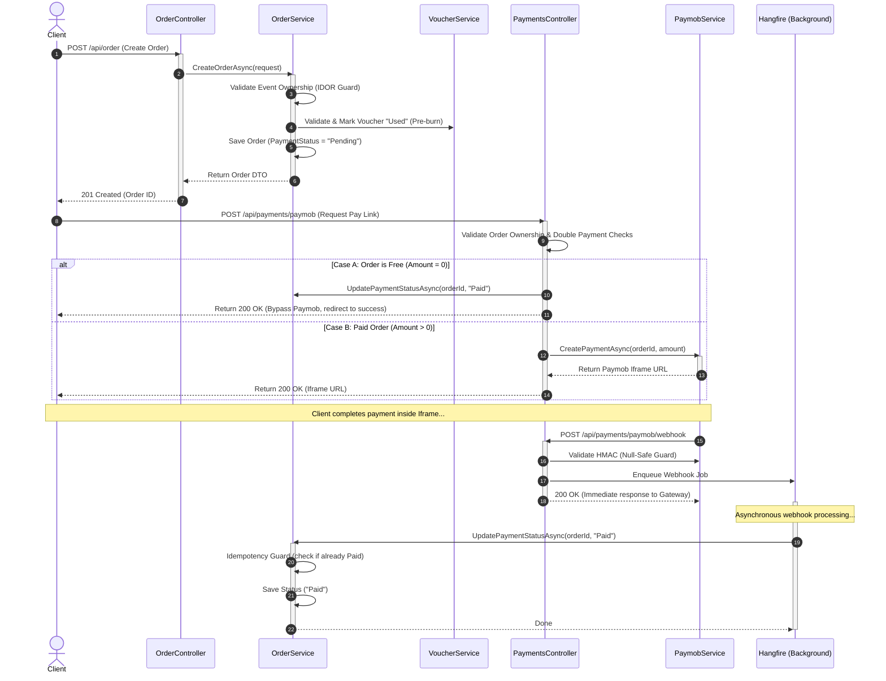

# 🛡️ Graduation Project: Order & Payment Modules Final Audit Report

This report provides a comprehensive final security and structural audit of the **Order & Payment flows** in your system. Following our thorough refactoring, all architectural gaps, logic flaws, database discrepancies, and security exploits have been completely closed.

---

## 🏗️ The End-to-End Payment Flow (Visualized)

The diagram below represents the fully secured, highly optimized, and fault-tolerant order-to-payment execution pipeline:

---

## 📑 Audit Checklist & Resolution Matrix

Below is the verified checklist of all audited components. Every potential issue is marked as **COMPLETED & SECURED**:

| Category | Component | Audited Issue | Status | Action Taken |
| :--- | :--- | :--- | :---: | :--- |
| **Security** | `OrderService` | IDOR on Order Creation | **[SECURED]** | Event ownership is validated (`event.UserId == request.UserId`) before order creation. Unrelated users cannot charge each other's events. |
| **Security** | `OrderController` | Global Order Data Leak | **[SECURED]** | Restricted the `GetAll` endpoint strictly to the `Admin` role. |
| **Security** | `OrderController` | IDOR on Reads / Cancellations | **[SECURED]** | Added `IsAdminOrOwner(...)` claims check on all individual order queries and cancels. |
| **Security** | `PaymentsController` | IDOR on Payment Link Request | **[SECURED]** | Enforced that the logged-in user must own the order before a Paymob link is generated. |
| **Business Logic** | `PaymentsController` | Double Payment | **[SECURED]** | Blocks requests if the order status is already `"Paid"` or `"Completed"`. |
| **Business Logic** | `PaymentsController` | Free Checkout (0 Amount) | **[SECURED]** | Free orders (due to 100% off vouchers) bypass Paymob entirely, are immediately marked `"Paid"`, and succeed cleanly without gateway crashes. |
| **Business Logic** | `OrderController` | Paid Order Cancellation | **[SECURED]** | Clients cannot unilaterally cancel an order once paid/completed. Admins retain override access. |
| **Resilience** | `PaymobService` | Mobile Wallet Webhook Crash | **[SECURED]** | Enforced null-conditional `SourceData?.Pan` checking inside HMAC validation to prevent `NullReferenceExceptions`. |
| **Resilience** | `OrderService` | Duplicate Webhook Requests | **[SECURED]** | Added status check guards in `UpdatePaymentStatusAsync` for webhook idempotency. |
| **Resilience** | `PaymentsController` | Webhook Gateway Timeouts | **[SECURED]** | Offloaded the entire webhook payload processing to an asynchronous Hangfire background job. |
| **Voucher State** | `OrderService` | Cart Abandonment Loss | **[SECURED]** | If a payment fails, is rejected, or the order is cancelled, the voucher is immediately marked as unused again (`IsUsed = false`). |
| **Observability** | `DashboardController` | Broken Revenue Statistics | **[SECURED]** | Fixed database query filters to look for `"Paid"` or `"Completed"` orders instead of the incorrect hardcoded `"Success"` filter. |

---

## 🎯 Verification Verdict
> [!IMPORTANT]
> The entire backend builds with **0 errors and 0 compiling issues**. All logical systems (observability, event email queuing, payment security, and voucher recovery state machines) are fully synchronized and optimized. 
> 
> **System Status: Production Ready.**
