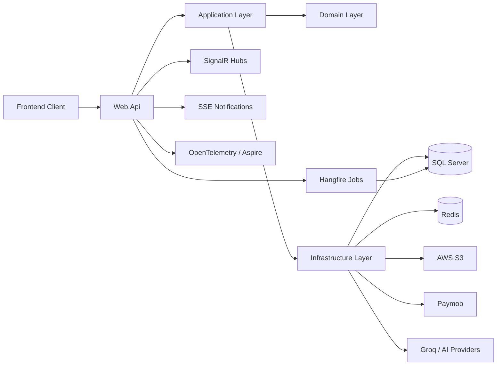

# EpicHub Web App Documentation

## 1. Overview

EpicHub is an event marketplace and planning platform that connects clients with vendors who provide event-related services. The backend is implemented as an ASP.NET Core Web API using a layered architecture, with support for authentication, vendor and service discovery, event planning, bookings, payments, real-time chat, notifications, AI planning, reporting, and admin operations.

The platform is designed around three main user groups:

- **Clients:** Browse vendors and services, create events, book services, pay for orders, collaborate with others, receive notifications, and review completed services.
- **Vendors:** Manage vendor profiles, publish services, receive booking requests, communicate with clients, and view reporting data.
- **Admins:** Manage users, vendors, service taxonomy, event taxonomy, support tickets, reporting, and operational oversight.

## 2. Project Structure

The solution is organized into multiple projects and folders:

```text
src/
|-- Application/         Business services, DTOs, interfaces, AI planning, caching helpers
|-- Domain/              Entities, enums, contracts, value objects
|-- Infrastructure/      EF Core persistence, repositories, Lucene search, reporting, jobs
|-- Web.Api/             API controllers, middleware, SignalR hubs, app startup
|-- ReverseProxy/        Reverse proxy project
|-- Shared/              Shared result types, pagination, exceptions, helpers
|-- UnitTests/           Unit tests for services, controllers, middleware, and result types
|-- IntegrationTests/    Repository and persistence integration tests
|-- Documentation/       Project documentation and audit notes
```

This structure follows Clean Architecture principles: domain models stay separate from persistence and web concerns, while the API layer delegates business behavior to application services.

## 3. Technology Stack

| Area | Technology |
| --- | --- |
| Backend | ASP.NET Core Web API, .NET 9 |
| Authentication | ASP.NET Core Identity, JWT Bearer tokens |
| Database | SQL Server, Entity Framework Core |
| Caching | Redis, .NET HybridCache, in-memory caching |
| Search | Lucene.NET |
| Background Jobs | Hangfire with SQL Server storage |
| Real-Time Messaging | SignalR with Redis scale-out |
| Notifications | Server-Sent Events and persisted notifications |
| Payments | Paymob integration and webhook handling |
| File Storage | AWS S3 |
| AI | Groq/OpenAI-compatible client, Gemini client registration, Llama helper services |
| Reporting | Executive reports, PDF generation, scheduled report jobs |
| Observability | OpenTelemetry, Aspire Dashboard, Serilog |
| Resilience | Polly / Microsoft resilience handlers, retries, timeouts, circuit breakers |
| Containers | Docker Compose with API, SQL Server, Redis, Aspire Dashboard |
| Testing | xUnit, Moq, EF Core SQLite integration tests |

## 4. Main Business Modules

### 4.1 Authentication and Users

The system uses ASP.NET Core Identity with GUID-based users and JWT authentication. It supports:

- Login
- Registration
- Email existence checks
- Refresh tokens
- Forgot password flow
- Reset password flow
- Logout
- User listing and administration
- Account suspension and unsuspension
- Role-based authorization

JWT token extraction is also configured for SignalR and SSE endpoints, allowing authenticated real-time connections.

### 4.2 Vendor Management

Vendors can create and maintain marketplace profiles. Vendor functionality includes:

- Vendor creation
- Vendor listing and details
- Vendor profile updates
- Vendor deletion
- Vendor approval by admin
- Vendor bookings
- Vendor ratings
- AI-generated vendor vibe summaries

Vendors are classified by vendor types and linked to services, packages, ratings, address data, and uploaded documents or media.

### 4.3 Service and Service Type Management

Services represent the actual marketplace offerings. The system supports:

- Service creation, update, deletion, and listing
- Filtering by vendor
- Filtering by service type
- Filtering by event type
- Service activation/deactivation status
- Service ratings
- Service images
- Service areas

Service types and vendor types provide taxonomy for discovery and marketplace organization.

### 4.4 Event Planning

Events are the central planning object for clients. The API supports:

- Event creation and update
- Event details and user-specific event lookup
- Event status filtering
- Event cancellation
- Event deletion
- Event item management
- Vendor approval flow for event items
- AI-assisted event creation/planning
- Event collaborators

Event items connect events to booked services and track service-level booking state.

### 4.5 Collaboration

The app supports collaborative event planning through:

- Adding collaborators to an event
- Listing collaborators
- Removing collaborators
- Assigning collaborator roles such as viewer/editor-style access

This is useful for families, teams, event organizers, and clients working with planners.

### 4.6 Orders and Payments

Orders are created around events and approved event items. Payment functionality includes:

- Order creation
- Order listing and details
- User-specific order retrieval
- Payment status updates
- Payment intent updates
- Order cancellation
- Paymob payment session creation
- Paymob webhook processing

The payment design includes protections for duplicate payment attempts, webhook retries, and sensitive state changes.

### 4.7 Vouchers and Referrals

The voucher module supports:

- Referral link retrieval
- User voucher listing
- Voucher validation
- Discount application through voucher codes

This gives the platform a foundation for referral campaigns, loyalty, and promotional discounts.

### 4.8 Chat and Notifications

Real-time communication is handled with SignalR and notification streaming:

- Chat conversations
- Message retrieval by user
- SignalR chat hub
- Notification hub/service
- SSE notification stream
- Notification listing
- Mark notification as read

Redis backplane support is configured for SignalR, which helps when scaling the API horizontally.

### 4.9 Support Tickets

Admins can manage customer and vendor support tickets. The support module includes:

- Opening tickets
- Listing tickets
- Ticket statistics
- Ticket details
- Replies
- Assignment
- Resolution
- Escalation to senior management, legal team, or CTO-level targets

Ticket status, priority, type, replies, agents, and escalation concepts are represented in the domain.

### 4.10 AI Planning and Insights

The API includes AI-powered planning endpoints:

- Smart budget allocation
- Event timeline generation
- Client similarity / recommendations
- AI event creation support
- Vendor vibe summaries
- AI-assisted reporting insights

The application uses an OpenAI-compatible Groq client for Llama 3.3 and also registers Gemini-related services. This gives the platform a strong differentiator compared with a normal event booking system.

### 4.11 Search

Lucene.NET is used for fast search and filtering across marketplace data. Search support includes:

- Vendor/service fuzzy search
- Filtering by taxonomy and price-style criteria
- A rebuild endpoint for refreshing the search index
- A recurring Hangfire job for daily Lucene synchronization

### 4.12 Reporting and Dashboards

The reporting system supports operational and executive visibility:

- Dashboard statistics
- Executive report generation
- Vendor report generation
- PDF report download
- Report email delivery
- Monthly vendor report jobs
- Monthly admin report jobs
- Report history entities
- Analytics query services

This is valuable for admins and vendors because the app does not only process bookings; it also helps stakeholders understand performance.

### 4.13 Company Inquiries

The company inquiry module supports basic CRUD operations for corporate or business inquiries:

- Create inquiry
- List inquiries
- Get inquiry details
- Update inquiry
- Delete inquiry

## 5. API Endpoint Summary

| Controller | Main Responsibility |
| --- | --- |
| `AuthenticationController` | Login, register, refresh token, password reset, logout |
| `UserController` | User management, suspension, updates |
| `VendorController` | Vendor profiles, approval, ratings, bookings, AI vibe |
| `VendorTypeController` | Vendor type taxonomy |
| `ServiceController` | Marketplace services, filtering, status, ratings |
| `ServiceTypeController` | Service type taxonomy |
| `EventController` | Events, event items, AI event creation, collaborators |
| `EventTypeController` | Event type taxonomy |
| `OrderController` | Orders and payment state |
| `PaymobController` | Paymob checkout and webhooks |
| `VoucherController` | Referral links and voucher validation |
| `ChatController` | Conversations and messages |
| `NotificationController` | SSE stream, notifications, read status |
| `SupportTicketsController` | Admin support ticket operations |
| `DashboardController` | Dashboard statistics and reports |
| `ReportsController` | Executive reporting, PDF, email delivery |
| `AIController` | Budget allocation, timeline, recommendations |
| `SearchController` | Search index rebuild |
| `FileController` | File upload |
| `CompanyInquiryController` | Company inquiry CRUD |

## 6. Runtime Architecture



The API acts as the entry point. Controllers receive requests, application services enforce business logic, repositories handle persistence, and external services are isolated behind infrastructure integrations.

## 7. Important Middleware and Cross-Cutting Features

The API includes several strong cross-cutting concerns:

- **Global exception handling:** Centralized error handling through custom middleware.
- **Standard result shaping:** Controller result filter normalizes responses.
- **Idempotency middleware:** Protects critical write operations from accidental duplicate execution.
- **Authorization result customization:** Returns consistent authorization failures.
- **Telemetry middleware:** Adds observability around requests.
- **Response compression:** Brotli/Gzip compression reduces payload size.
- **Rate limiter registration:** A fixed-window limiter is configured for request protection.
- **Serilog request logging:** Structured application logs are written with rolling files.
- **OpenTelemetry:** Traces and metrics are exported to an OTLP endpoint.

## 8. Data Model Highlights

Important persisted concepts include:

- `ApplicationUser`
- `Vendor`
- `VendorType`
- `Service`
- `ServiceType`
- `ServiceImage`
- `ServiceRating`
- `ServiceArea`
- `Event`
- `EventType`
- `EventItem`
- `EventCollaborator`
- `Order`
- `Voucher`
- `Conversation`
- `Message`
- `Notification`
- `SupportTicket`
- `SupportAgent`
- `TicketReply`
- `CorporationInquiry`
- `ReportRecord`
- `ScheduledReport`
- `OrderInsight`

The model supports marketplace discovery, booking workflows, collaboration, communication, payment history, analytics, and support operations.

## 9. Background Jobs

Hangfire is used for scheduled and asynchronous work:

- Daily Lucene index synchronization
- Monthly vendor reports
- Monthly admin reports
- Email delivery through background processing
- Payment webhook processing support

Using jobs keeps slow and retry-prone work out of the request-response path.

## 10. Deployment and Local Infrastructure

The Docker Compose setup includes:

- API container
- SQL Server 2022 container
- Redis container
- Aspire Dashboard container
- Persistent volumes for SQL Server and Redis

Local ports:

- API: `http://localhost:5000`
- SQL Server: `127.0.0.1:1433`
- Redis: `6379`
- Aspire Dashboard: `http://localhost:18888`
- OTLP endpoint: `http://localhost:18889`

## 11. Testing

The repository contains both unit and integration test projects:

- `UnitTests/Application.UnitTests.csproj`
- `IntegrationTests/EpicHub.IntegrationTests.csproj`

Test coverage includes services, controllers, middleware, repository behavior, result objects, cache behavior, order flows, vendor flows, support tickets, notifications, and domain-style logic.

Recommended test command:

```bash
dotnet test API.sln
```

## 12. Main Advantages

1. **Feature-rich platform:** The app covers discovery, booking, payments, chat, notifications, AI, reporting, support, and admin workflows.
2. **Clean layering:** Business logic is separated from controllers and infrastructure concerns.
3. **Real-time readiness:** SignalR, SSE, and Redis scale-out make communication features stronger.
4. **Production-style infrastructure:** SQL Server, Redis, Hangfire, Docker, OpenTelemetry, Serilog, and Aspire are already integrated.
5. **Resilient external calls:** Payment and storage integrations use retry, timeout, and circuit breaker patterns.
6. **Good marketplace foundation:** Vendor types, service types, event types, services, ratings, and search create a flexible marketplace model.
7. **AI differentiation:** Budget allocation, timeline generation, recommendations, and vibe summaries make the app more intelligent than a basic CRUD marketplace.
8. **Reporting depth:** Admin and vendor reports improve operational decision-making.
9. **Scalable cache/search approach:** HybridCache, Redis, and Lucene improve performance for read-heavy flows.
10. **Test projects exist:** Unit and integration test projects give the app a base for safer future changes.

## 13. Pros

- Uses modern .NET 9 with nullable reference types enabled.
- Applies Clean Architecture-style project separation.
- Uses ASP.NET Core Identity instead of custom password storage.
- Uses JWT for stateless API authentication.
- Supports role-based authorization for admin/vendor/client behavior.
- Has strong external integrations: Paymob, AWS S3, Redis, Lucene, OpenTelemetry, Hangfire.
- Includes global exception handling and custom result formatting.
- Includes idempotency protection for duplicate requests.
- Supports real-time chat with SignalR.
- Supports notification streaming through SSE.
- Uses Redis for distributed caching and SignalR scale-out.
- Uses Hangfire for scheduled and long-running work.
- Provides AI-assisted user experiences.
- Includes reporting and PDF/report delivery foundations.
- Has Docker Compose for repeatable local infrastructure.
- Contains unit and integration tests.

## 14. Cons and Current Limitations

- **Secrets appear to be stored in appsettings files.** API keys, payment credentials, JWT secrets, SMTP credentials, and cloud credentials should be moved to user secrets, environment variables, or a secret manager before production.
- **Swagger generation is currently commented out.** The app has many endpoints, so generated OpenAPI documentation would help frontend developers and testers.
- **Rate limiter is registered but must be applied in the pipeline.** `UseRateLimiter()` should be present in the runtime middleware pipeline for enforcement.
- **Some documentation files have encoding artifacts.** Several existing docs contain mojibake characters, which reduces readability.
- **Some service classes may become large over time.** Event, order, vendor, and AI workflows could eventually benefit from CQRS-style command/query separation.
- **Search index consistency needs careful operation.** Lucene is fast, but it must stay synchronized with SQL Server data.
- **Startup seeding can be risky in multi-instance production.** Database initialization should be handled carefully during deployment.
- **File-based logs are not ideal for containers.** Console logging or centralized log shipping is usually better in Docker/Kubernetes environments.
- **Configuration names are mixed.** Some settings reference Groq, Gemini, Ollama, and Llama concepts. This should be clarified so operators know which AI provider is active.
- **Frontend documentation depends on backend accuracy.** Because the API surface is large, endpoint examples should be regularly regenerated or reviewed.

## 15. Good Things About the Project

This project has several qualities that are impressive for a graduation project:

- It is not just a CRUD backend; it models a complete marketplace lifecycle.
- It includes real business flows: booking approval, order payment, vouchers, ratings, support, and reporting.
- It uses serious infrastructure concepts normally seen in production systems.
- It includes observability, which many student projects ignore.
- It has a strong domain: clients, vendors, services, events, orders, and collaboration all fit together naturally.
- It has AI features that are connected to real user value instead of being added only for appearance.
- It uses background jobs for tasks that should not block API requests.
- It contains both unit and integration tests, which is a major maintainability advantage.
- It has a clear path to scale: Redis, Hangfire, SQL Server, Docker, and external storage are already present.
- It is easy to explain in a demo because the app has concrete users, workflows, and measurable value.

## 16. Recommended Improvements

### High Priority

- Move all secrets out of committed configuration files.
- Enable and configure Swagger/OpenAPI for API discovery.
- Add `app.UseRateLimiter()` if rate limiting should be enforced.
- Review authorization on every admin/vendor/client endpoint.
- Add CI checks for `dotnet build` and `dotnet test`.

### Medium Priority

- Add endpoint-level XML comments and response examples.
- Add a generated API reference document.
- Improve consistency in route naming and casing.
- Add structured logging to console for container deployments.
- Add health checks for SQL Server, Redis, Hangfire, S3, and AI providers.
- Add an outbox pattern for events that trigger external side effects.

### Long-Term

- Introduce CQRS for complex event, order, and reporting flows.
- Add load testing for search, payment, and event booking flows.
- Add observability dashboards for latency, errors, background jobs, and cache hit rate.
- Add stronger index update guarantees for Lucene.
- Expand integration tests around payment webhooks, chat, notifications, and report jobs.

## 17. Suggested Demo Flow

1. Register or log in as a client.
2. Browse vendors and services.
3. Create an event.
4. Add one or more services to the event.
5. Let a vendor approve booking items.
6. Create an order from the approved items.
7. Pay through the Paymob flow.
8. Receive notifications.
9. Chat with the vendor.
10. Mark service delivery complete and add a rating.
11. Open the admin dashboard and review reports.
12. Generate an AI budget or timeline recommendation.

## 18. Summary

EpicHub is a strong full-stack product backend for an event marketplace. Its best qualities are the broad business coverage, clean project separation, real-time communication, payment handling, AI planning, reporting, background jobs, caching, search, and observability. The main areas to improve before production are secret management, OpenAPI documentation, rate limiter enforcement, deployment safety, and deeper automated testing around critical workflows.

Overall, the project demonstrates strong backend engineering maturity and has a solid foundation for a real event services marketplace.
