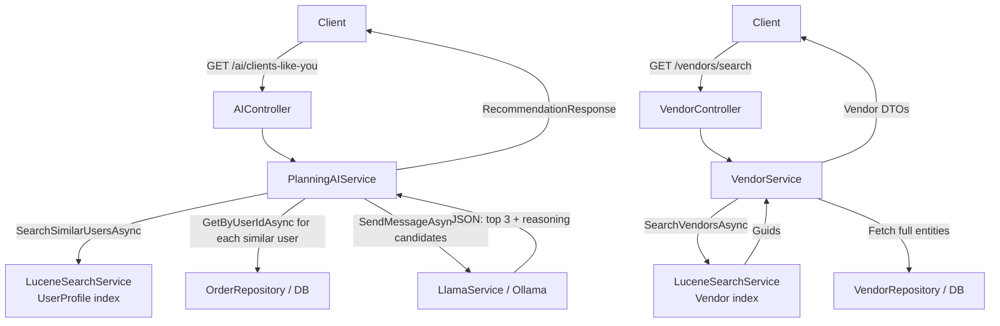

# AI Recommendation Services — Diff & Comparison

Two recommendation strategies are implemented and fully wired in the system.

---

## 1. "Clients Like You" — Collaborative Filtering Recommendations
**Endpoint:** `GET /api/AI/clients-like-you/{eventId}`  
**Service:** `PlanningAIService.GetClientsLikeYouRecommendationsAsync()`  
**Lucene Role:** `SearchSimilarUsersAsync()` (UserProfile index)

### How it works
```
User books services
    → User profile indexed in Lucene (BookedVendors + BookedCategories)
        → At query time: search for other users with overlapping vendors/categories
            → Collect services those similar users booked (that current user hasn't)
                → Feed candidate list to Llama → pick top 3 with reasoning
```

### Key Characteristics

| Property | Detail |
|---|---|
| **Algorithm** | Collaborative Filtering (User-User) |
| **AI model** | Llama (via `LlamaService.SendMessageAsync`) |
| **Index type** | `UserProfile` documents in Lucene |
| **Indexed fields** | `BookedVendors` (space-sep VendorIds), `BookedCategories` (space-sep names) |
| **Lucene query** | `SHOULD` on BookedVendors + BookedCategories, `MUST` Type=UserProfile |
| **Cold start handled** | ✅ Yes — if no history, Llama falls back to industry-standard suggestions |
| **Deduplication** | ✅ Filters out services already booked by the user |
| **Output** | `RecommendationResponse` → list of `{ ServiceId (VendorId), Reasoning }` |
| **Caching** | HybridCache 1h on `ai-recommendations/{eventId}` |
| **Auth** | Requires authenticated user (extracts `UserId` from JWT) |

### Sync job
`LuceneSyncJob` (Hangfire) re-indexes user profiles in bulk via `IndexUserProfilesBatchAsync()`  
→ Keeps the UserProfile index fresh without blocking the request pipeline.

---

## 2. Vendor / Service Search — Content-Based Fulltext Recommendations
**Endpoints:** Used internally by `VendorService` / `ProductService`  
**Service:** `LuceneSearchService.SearchVendorsAsync()` / `SearchServicesAsync()`  
**Lucene Role:** `Vendor` and `Service` document indexes

### How it works
```
Client sends a keyword/category/location query
    → Lucene BooleanQuery with fuzzy text matching
        → Returns ranked list of Vendor or Service GUIDs
            → Caller fetches full entities from DB by those IDs
```

### Key Characteristics

| Property | Detail |
|---|---|
| **Algorithm** | Content-based fulltext search (BM25/TF-IDF via Lucene) |
| **AI model** | ❌ None — pure Lucene ranking |
| **Index type** | `Vendor` and `Service` documents |
| **Indexed fields (Vendors)** | BusinessName, Description, VendorType, City, State, IsVerified |
| **Indexed fields (Services)** | Name, Description, ServiceType, ServiceTypeId, Price, VendorId, VendorName |
| **Lucene query** | Fuzzy multi-field MUST + optional filter clauses (category, location, price range) |
| **Cold start handled** | N/A — always returns results by relevance |
| **Personalization** | ❌ None — same results for all users given same query |
| **Output** | `IEnumerable<Guid>` (raw IDs, caller resolves to entities) |
| **Caching** | Not cached at the search layer (callers may cache) |
| **Auth** | No — public search |

---

## Side-by-Side Diff

| Dimension | Clients Like You | Vendor/Service Search |
|---|---|---|
| **Personalized?** | ✅ Per-user history | ❌ Query-based only |
| **Uses AI (Llama)?** | ✅ Yes | ❌ No |
| **Algorithm type** | Collaborative Filtering | Content-Based / Fulltext |
| **Lucene document type** | `UserProfile` | `Vendor`, `Service` |
| **Similarity signal** | Shared bookings between users | Keyword relevance to query |
| **Output granularity** | 3 service recommendations + reasoning | Up to 50 IDs ranked by score |
| **Cold start strategy** | Llama falls back to generic advice | Always returns results |
| **Sync mechanism** | Hangfire batch job (user profiles) | Hangfire batch job (vendors/services) |
| **Caller** | `AIController` | `VendorService`, `ProductService` |
| **Response format** | Structured JSON (`RecommendationResponse`) | Raw `IEnumerable<Guid>` |
| **Caching layer** | HybridCache (Redis+Memory) 1h | None at search layer |

---

## Architecture Flow



---

## Key Design Decisions

> [!NOTE]
> The **Clients Like You** service is the only one that uses Llama. Lucene is used as a fast nearest-neighbor lookup to *find* similar users, and Llama is then used to *reason over* the candidate services. This hybrid approach avoids sending the entire dataset to the LLM.

> [!TIP]
> The **Vendor/Service search** is intentionally AI-free. It's a high-frequency, low-latency operation used during browsing. Adding Llama here would add 2–5s of latency per search.

> [!IMPORTANT]
> Both recommendation paths share the **same `LuceneSearchService` singleton** and the **same physical Lucene index directory**, but use different document `Type` fields (`UserProfile` vs `Vendor`/`Service`) to partition the index namespace.
