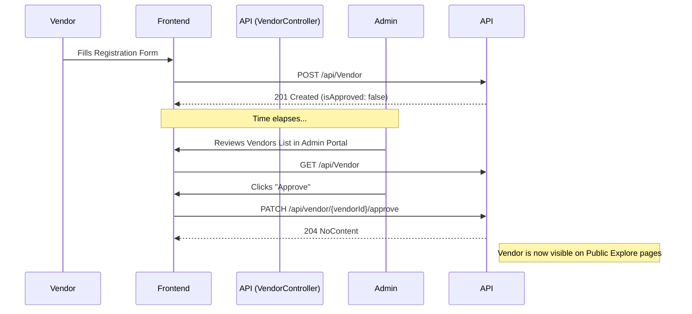
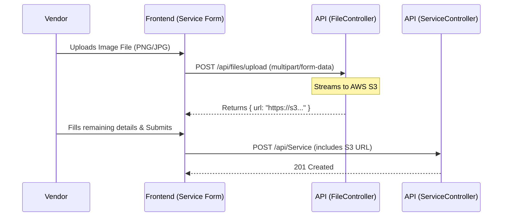
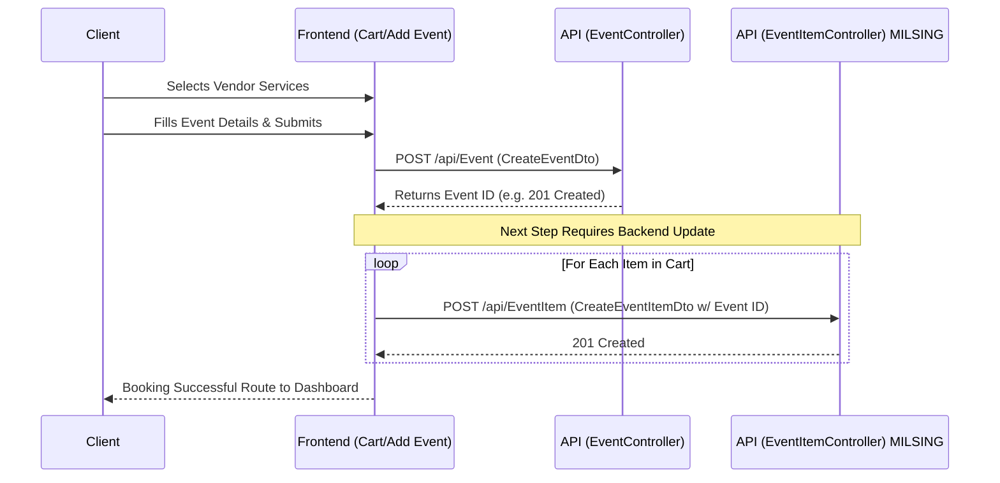
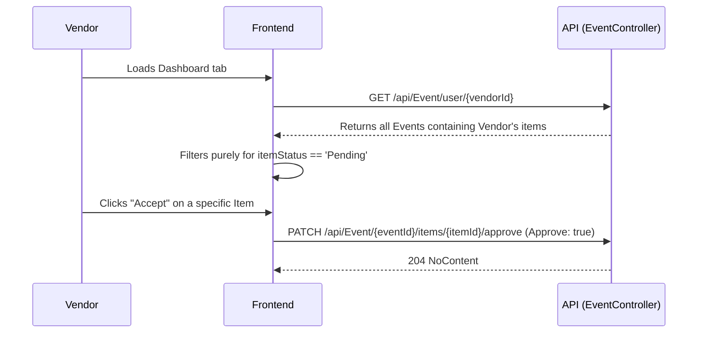

# System Business Logic & Architecture Reference

This document serves as the single source of truth for the system's frontend-to-backend workflows, business rules, and technical data flows. It is intended for onboarding, future planning, and ensuring cross-functional cohesion.

---

## 1. Core Domains & Roles

The system is partitioned into three discrete access levels governed by role-based JWT Authentication:

1. **Client (User)**: Can explore vendor services, maintain a cart of services, create an `Event`, and track bookings.
2. **Vendor**: Must be approved by an Admin to appear publicly. Vendors manage `Services` (referred to simply as Products), manage their public profile, view incoming requests via Dashboard, and Accept/Reject event items.
3. **Admin**: Manages taxonomy (Categories, Service/Event Types) and handles the verification and lifecycle moderation of Users and Vendors.

---

## 2. Core Workflows & Business Rules

### A. Vendor Onboarding & Approval Flow
By default, when a Vendor registers, they are not immediately publicly visible. They require administrative approval.

**Business Rules:**
- Only users with the `Admin` role can invoke the approval patch endpoint.
- Public views (e.g., Home Page, Discover) must explicitly filter for `isApproved == true` and `status == 'active'` to ensure pending vendors do not receive traffic.

### B. Vendor Service & File Upload Flow
Vendors create offerings (Services/Products) that are ultimately booked by clients. These services require image attachments.

**Business Rules:**
- Image files are uploaded independently to an AWS S3 bucket via the File Controller before the Service record is created.
- The returned S3 URL is stored as `imageUrl` inside the Service (Product) DTO.

### C. The Event Creation & Booking Flow (Client Checkout)
Events represent a single user occasion (e.g., a Wedding) composed of multiple `EventItems` (the specific Vendor Services being hired). 

> [!WARNING]
> **CRITICAL ARCHITECTURAL GAP IDENTIFIED:**
> Based on our cross-reference of the codebase, the backend features `EventItemService` and `CreateEventItemDto`, but **lacks an `EventItemController` or an endpoint to actually add items to a created event.** For the system to be cohesive, a new controller or a compound endpoint (e.g., `POST /api/Event/{id}/items`) MUST be implemented in the backend before the frontend booking flow can be finalized.

**Target Business Rules (Once Gap is resolved):**
1. **Authentication Required**: Clients must be logged in (authorized) to access the Event Creation / Cart interfaces. Unauthenticated users are redirected by `authGuard`.
2. The Frontend maintains a local state/cart of selected vendor services.
3. The User fills out the Event Details (Title, Date, Budget, Location) and hits "Book".
4. The Frontend executes a two-step transaction: First creating the master Event, then iterating through the cart to create associated Event Items.

### D. Vendor Booking Moderation (Approve/Reject Requests)
When an Event Item is created, it defaults to a `Pending` status. Vendors review these pending items on their dashboard.

**Business Rules:**
- The frontend retrieves pending requests by mapping over `EventItem` objects returned from the `GET /api/Event/user/{vendorId}` aggregate endpoint. 
- Vendors patch individual items, not the master event.

---

## 3. Recommended Remediation & Next Steps

1. **Backend Integration Required**: A backend developer must expose `POST /api/EventItem` (or similar) using the existing `IEventItemService` logic.
2. **Phase 1 Execution (Current Frontend Scope)**: Since `Admin Users/Vendors` do not rely on the missing endpoints, we can execute the administrative interfaces seamlessly without blockers.
