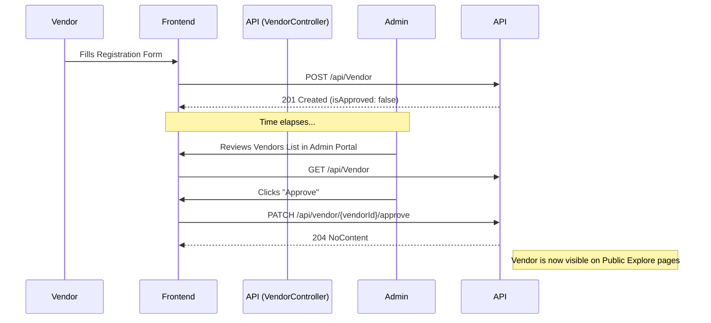
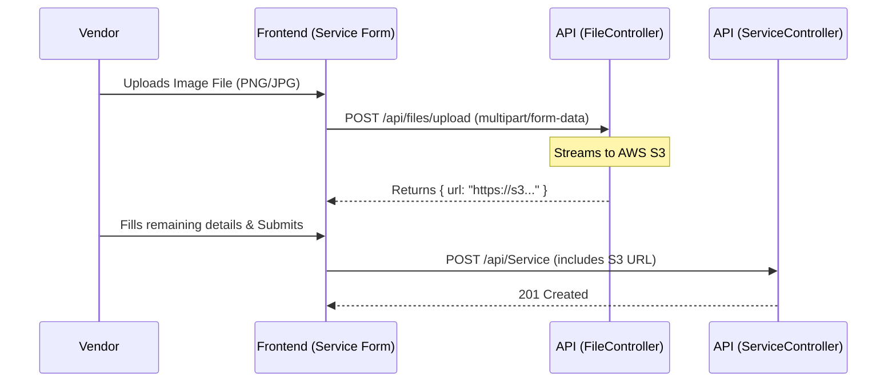
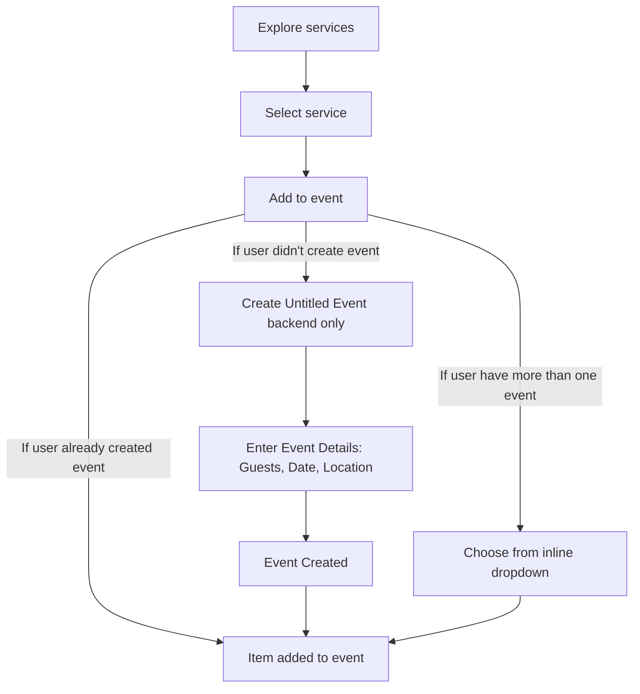
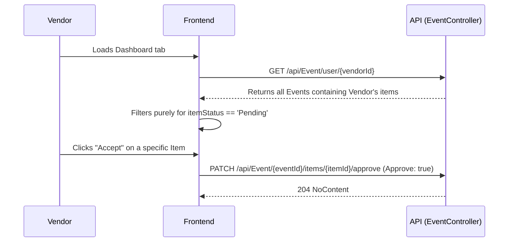
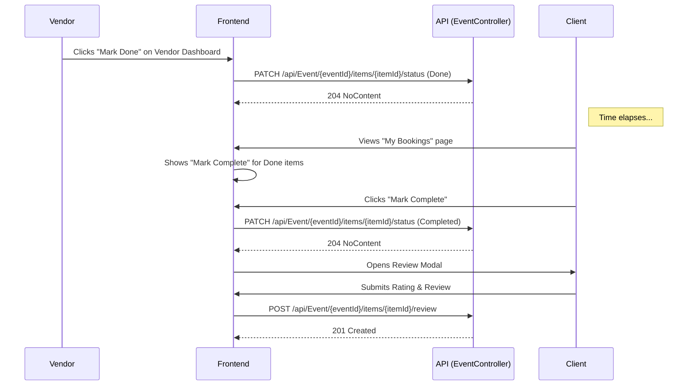
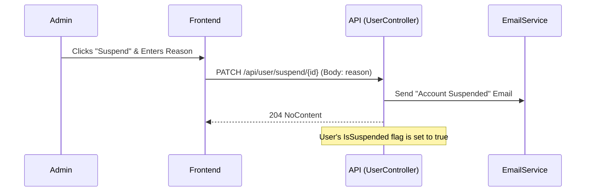
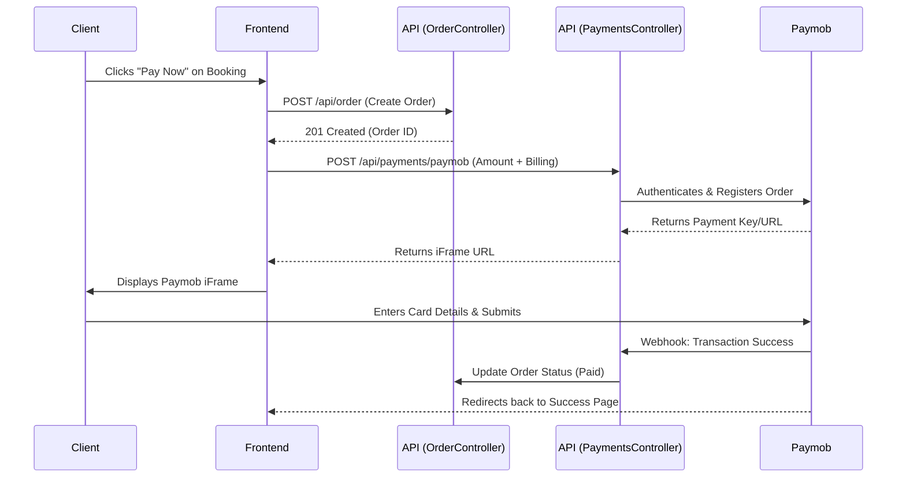
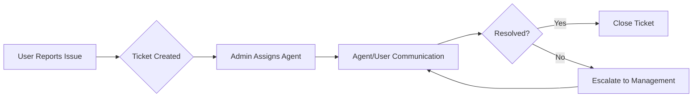

# System Business Logic & Architecture Reference

This document serves as the single source of truth for the system's frontend-to-backend workflows, business rules, and technical data flows. It is intended for onboarding, future planning, and ensuring cross-functional cohesion.

---

## 1. Core Domains & Roles

The system is partitioned into three discrete access levels governed by role-based JWT Authentication:

1. **Client (User)**: Can explore vendor services, maintain a cart of services, create an `Event`, and track bookings.
2. **Vendor**: Must be approved by an Admin to appear publicly. Vendors manage `Services` (referred to simply as Products), manage their public profile, view incoming requests via Dashboard, and Accept/Reject event items.
3. **Admin**: Manages taxonomy (Categories, Service/Event Types) and handles the verification and lifecycle moderation of Users and Vendors.

---

## 2. Core Workflows & Business Rules

### A. Vendor Onboarding & Approval Flow
By default, when a Vendor registers, they are not immediately publicly visible. They require administrative approval.

**Business Rules:**
- Only users with the `Admin` role can invoke the approval patch endpoint.
- Public views (e.g., Home Page, Discover) must explicitly filter for `isApproved == true` and `status == 'active'` to ensure pending vendors do not receive traffic.

### B. Vendor Service & File Upload Flow
Vendors create offerings (Services/Products) that are ultimately booked by clients. These services require image attachments.

**Business Rules:**
- Image files are uploaded independently to an AWS S3 bucket via the File Controller before the Service record is created.
- The returned S3 URL is stored as `imageUrl` inside the Service (Product) DTO.

### C. The Event Creation & Booking Flow (Direct-to-Event)
Events represent a single user occasion (e.g., a Wedding) composed of multiple `EventItems` (the specific Vendor Services being hired). There is no "Cart"; services are added directly to Events.

**Business Rules:**
1. **Authentication Required**: Clients must be logged in (authorized) to add services to an event.
2. **Direct to Event Workflow**: When a user selects a service and clicks "Add to event", the system checks the user's existing events:
   - **Scenario A (No existing events)**: An "Untitled Event" is created (backend), and the user is prompted to enter Event Details (No. of guests, Date, Location, Specific requirements). Once entered, the event is finalized and the item is added to it.
   - **Scenario B (One existing event)**: The item is automatically added to this existing event.
   - **Scenario C (Multiple existing events)**: The "Add to event" button dynamically transforms into an inline dropdown containing the user's existing events and a "+ Create New Event" option, allowing the user to select the destination or spin up a new event directly.

### D. Vendor Booking Moderation (Approve/Reject Requests)
When an Event Item is created, it defaults to a `Pending` status. Vendors review these pending items on their dashboard.

**Business Rules:**
- The frontend retrieves pending requests by mapping over `EventItem` objects returned from the `GET /api/Event/user/{vendorId}` aggregate endpoint. 
- Vendors patch individual items, not the master event.

---

### E. Taxonomy & Classification Rules

The marketplace organizes its providers and offerings based on a three-dimensional taxonomy to optimize search relevance and matching.

**1. Vendor Type (Primary Category)**
- **What it is:** "What are you?" (e.g., Photographer, Venue, Decor Company).
- **Rule:** A `Vendor` MUST have exactly ONE `VendorType`.
- **Purpose:** Used for the **Vendor Explore Page**, allowing users to browse providers by category (e.g., "Browse Photographers").

**2. Service Type (Secondary Subcategory)**
- **What it is:** "What services do you offer?" (e.g., Wedding Photography, DJ, Balloon Styling).
- **Rule:** A `Vendor` can have MULTIPLE `ServiceTypes`. However, the selectable `ServiceTypes` MUST be dependent on the vendor's primary `VendorType` (e.g., A "Photographer" can select "Wedding Photography" but not "Catering").
- **Purpose:** Used for the **Service Explore Page**, allowing users to search by specific need (e.g., "Browse DJs").

**3. Event Types Served (Supply & Demand Matching)**
- **What it is:** "What events do you serve?" (e.g., Weddings, Corporate Events).
- **Rule:** A `Vendor` can select MULTIPLE `EventTypes` they cater to.
- **Purpose:** Drives recommendation relevance. When a user creates a "Corporate Event", the system prioritizes and suggests vendors who have explicitly marked that they serve "Corporate Events".

**Matching Logic (The Recommendation Engine):**
- **Match by Need:** User searches for a specific service (e.g., DJ) → Show vendors with the DJ `ServiceType`.
- **Match by Event Relevance:** User plans a Corporate Event → Prioritize vendors serving Corporate Events.
- **Perfect Match:** User plans a Corporate Event and needs a DJ → Show vendors matching BOTH criteria (High Relevance Score).

### F. Post-Service Completion & Review Flow

After a vendor's service is approved and eventually delivered, the booking goes through a completion lifecycle allowing clients to review the service.

**Business Rules:**
- **Done**: The Vendor marks the item as `Done` when the service is delivered/finished.
- **Completed**: The Client (User) marks the item as `Completed` to acknowledge the delivery and finalize the transaction.
- **Review**: Once `Completed`, the Client is prompted with a Review Modal to submit a rating and feedback text. This rating influences the vendor's overall profile score.

### G. Admin User Management Flow

Administrators have the authority to suspend or unsuspend Users and Vendors based on platform policy violations.

**Business Rules:**
- Only users with the `Admin` role can invoke the suspend/unsuspend endpoints.
- When an account is `Suspended`, the user/vendor cannot log into the platform (`UnauthorizedException` is thrown).
- Existing valid JWT tokens might still work until expiration unless revoked, but new logins are blocked.
- Suspending or unsuspending an account automatically triggers an email notification to the user detailing the action and the reason (if suspended).

### H. Payment & Order Integration (Paymob)

The platform uses Paymob to handle financial transactions. Orders are the bridge between an Event (planning) and Payment (finalization).

**Business Rules:**
- **Order Creation**: An order is created directly from an `Event`. The backend dynamically calculates the order amount based on the `Approved` Event Items within the Event. `OrderItem` entities have been removed to simplify the data model.
- **Paymob iFrame**: The frontend requests a payment session from the backend, which returns an iFrame URL where the user enters card details securely.
- **Status Sync**: Paymob notifies the backend via Webhooks upon successful or failed payment. The Order status is then updated to `Paid` or `Failed`.
- **Billing Data**: Users must provide a billing address and contact info (first name, last name, email, phone) to initiate payment.

### I. Support Ticket System

To maintain marketplace trust, a centralized Support Ticket system allows users to report issues and admins to resolve them.

**Business Rules:**
- **Categorization**: Tickets are typed by `Technical`, `Booking`, `Payment`, or `General`.
- **Prioritization**: Ranging from `Low` to `Critical`. Critical tickets (e.g., "Vendor didn't show up") are flagged for immediate action.
- **Lifecycle**: `Open` → `In Progress` → `Resolved`.
- **Escalation**: Admins can escalate complex tickets to `Senior Management`, `Legal`, or `CTO`.

### J. Loyalty & Rewards Program

The platform rewards frequent users through a loyalty points system to encourage retention.

**Business Rules:**
- **Earning Logic**: Users earn **1 Point for every 10 EGP spent** on successful bookings.
- **Eligibility**: Points are only awarded once an Order is marked as `Paid` or `Completed`.
- **Point Value**: Points can be redeemed for discounts (Implementation in progress).
- **Visibility**: Users can view their current point balance on their Personal Dashboard.

---

## 3. Current Status & Next Steps

1. **Loyalty Redemption**: Implement the backend logic and frontend UI for users to redeem their loyalty points as discounts on future bookings.
2. **AI-Powered Matching**: Enhance the "Smart Checklist" to use Gemini AI for more personalized vendor recommendations based on event descriptions.
3. **Advanced Support Analytics**: Develop an Admin dashboard for tracking ticket resolution rates and common platform pain points.
