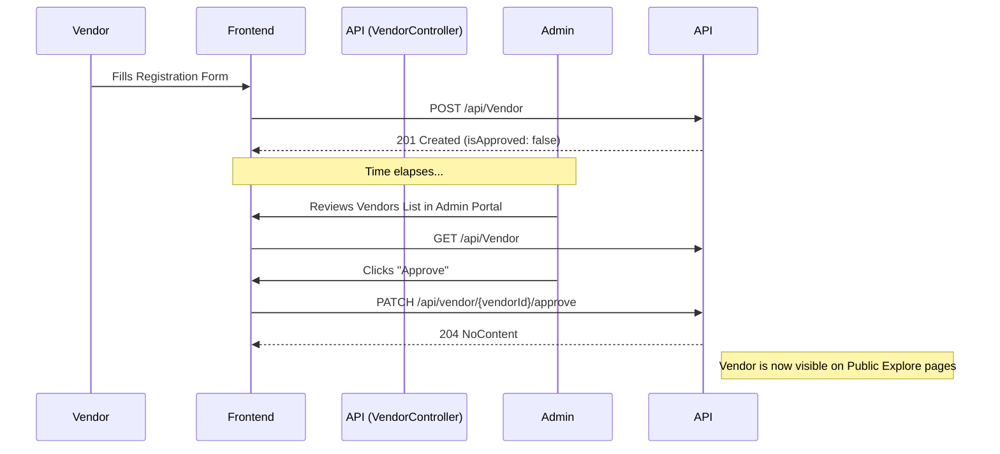
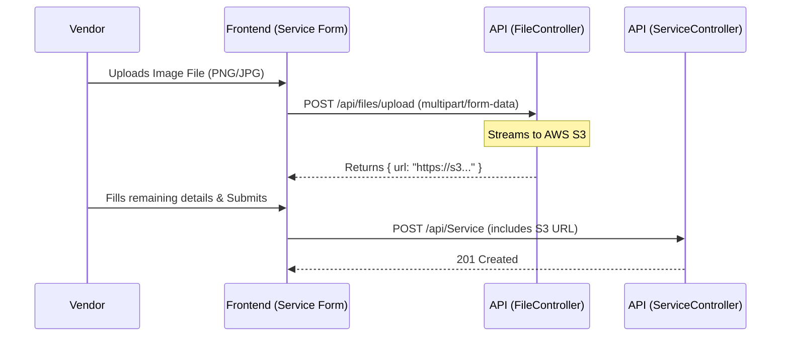
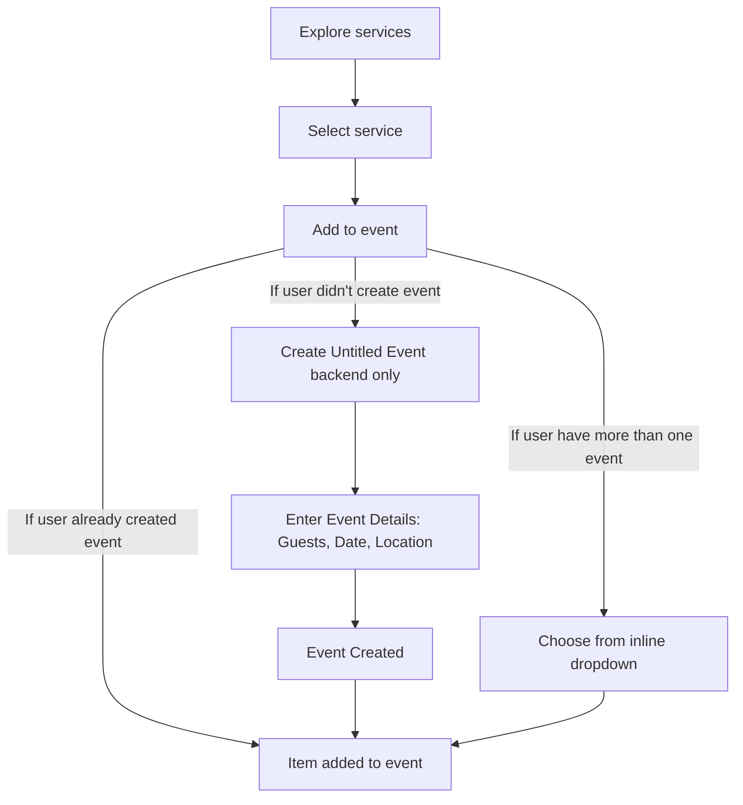
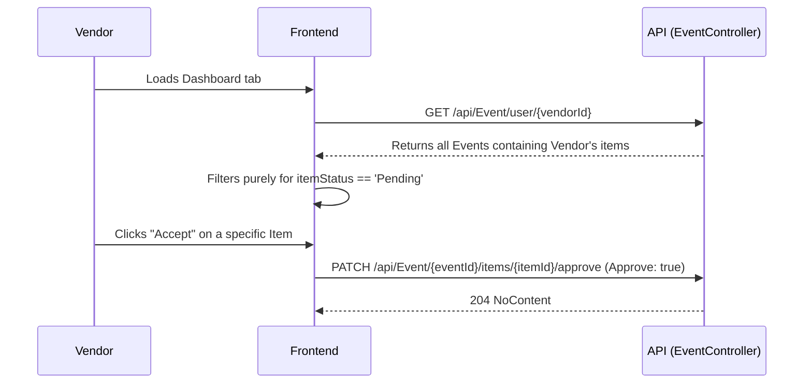

# System Business Logic & Architecture Reference

This document serves as the single source of truth for the system's frontend-to-backend workflows, business rules, and technical data flows. It is intended for onboarding, future planning, and ensuring cross-functional cohesion.

---

## 1. Core Domains & Roles

The system is partitioned into three discrete access levels governed by role-based JWT Authentication:

1. **Client (User)**: Can explore vendor services, maintain a cart of services, create an `Event`, and track bookings.
2. **Vendor**: Must be approved by an Admin to appear publicly. Vendors manage `Services` (referred to simply as Products), manage their public profile, view incoming requests via Dashboard, and Accept/Reject event items.
3. **Admin**: Manages taxonomy (Categories, Service/Event Types) and handles the verification and lifecycle moderation of Users and Vendors.

---

## 2. Core Workflows & Business Rules

### A. Vendor Onboarding & Approval Flow
By default, when a Vendor registers, they are not immediately publicly visible. They require administrative approval.

**Business Rules:**
- Only users with the `Admin` role can invoke the approval patch endpoint.
- Public views (e.g., Home Page, Discover) must explicitly filter for `isApproved == true` and `status == 'active'` to ensure pending vendors do not receive traffic.

### B. Vendor Service & File Upload Flow
Vendors create offerings (Services/Products) that are ultimately booked by clients. These services require image attachments.

**Business Rules:**
- Image files are uploaded independently to an AWS S3 bucket via the File Controller before the Service record is created.
- The returned S3 URL is stored as `imageUrl` inside the Service (Product) DTO.

### C. The Event Creation & Booking Flow (Direct-to-Event)
Events represent a single user occasion (e.g., a Wedding) composed of multiple `EventItems` (the specific Vendor Services being hired). There is no "Cart"; services are added directly to Events.

**Business Rules:**
1. **Authentication Required**: Clients must be logged in (authorized) to add services to an event.
2. **Direct to Event Workflow**: When a user selects a service and clicks "Add to event", the system checks the user's existing events:
   - **Scenario A (No existing events)**: An "Untitled Event" is created (backend), and the user is prompted to enter Event Details (No. of guests, Date, Location, Specific requirements). Once entered, the event is finalized and the item is added to it.
   - **Scenario B (One existing event)**: The item is automatically added to this existing event.
   - **Scenario C (Multiple existing events)**: The "Add to event" button dynamically transforms into an inline dropdown containing the user's existing events and a "+ Create New Event" option, allowing the user to select the destination or spin up a new event directly.

### D. Vendor Booking Moderation (Approve/Reject Requests)
When an Event Item is created, it defaults to a `Pending` status. Vendors review these pending items on their dashboard.

**Business Rules:**
- The frontend retrieves pending requests by mapping over `EventItem` objects returned from the `GET /api/Event/user/{vendorId}` aggregate endpoint. 
- Vendors patch individual items, not the master event.

---

### E. Taxonomy & Classification Rules

The marketplace organizes its providers and offerings based on a three-dimensional taxonomy to optimize search relevance and matching.

**1. Vendor Type (Primary Category)**
- **What it is:** "What are you?" (e.g., Photographer, Venue, Decor Company).
- **Rule:** A `Vendor` MUST have exactly ONE `VendorType`.
- **Purpose:** Used for the **Vendor Explore Page**, allowing users to browse providers by category (e.g., "Browse Photographers").

**2. Service Type (Secondary Subcategory)**
- **What it is:** "What services do you offer?" (e.g., Wedding Photography, DJ, Balloon Styling).
- **Rule:** A `Vendor` can have MULTIPLE `ServiceTypes`. However, the selectable `ServiceTypes` MUST be dependent on the vendor's primary `VendorType` (e.g., A "Photographer" can select "Wedding Photography" but not "Catering").
- **Purpose:** Used for the **Service Explore Page**, allowing users to search by specific need (e.g., "Browse DJs").

**3. Event Types Served (Supply & Demand Matching)**
- **What it is:** "What events do you serve?" (e.g., Weddings, Corporate Events).
- **Rule:** A `Vendor` can select MULTIPLE `EventTypes` they cater to.
- **Purpose:** Drives recommendation relevance. When a user creates a "Corporate Event", the system prioritizes and suggests vendors who have explicitly marked that they serve "Corporate Events".

**Matching Logic (The Recommendation Engine):**
- **Match by Need:** User searches for a specific service (e.g., DJ) → Show vendors with the DJ `ServiceType`.
- **Match by Event Relevance:** User plans a Corporate Event → Prioritize vendors serving Corporate Events.
- **Perfect Match:** User plans a Corporate Event and needs a DJ → Show vendors matching BOTH criteria (High Relevance Score).

---

## 3. Current Status & Next Steps

1. **Taxonomy Realignment**: Update the database schema and API to support the defined taxonomy (`VendorType` dependency for `ServiceType`, and `VendorEventType` mappings).
2. **Explore Pages Separation**: Implement distinct routing and UI for "Vendor Explore" and "Service Explore" on the frontend.
3. **Smart Checklist Flow**: Develop the flow where choosing an Event Type suggests relevant Service Types to the user.
